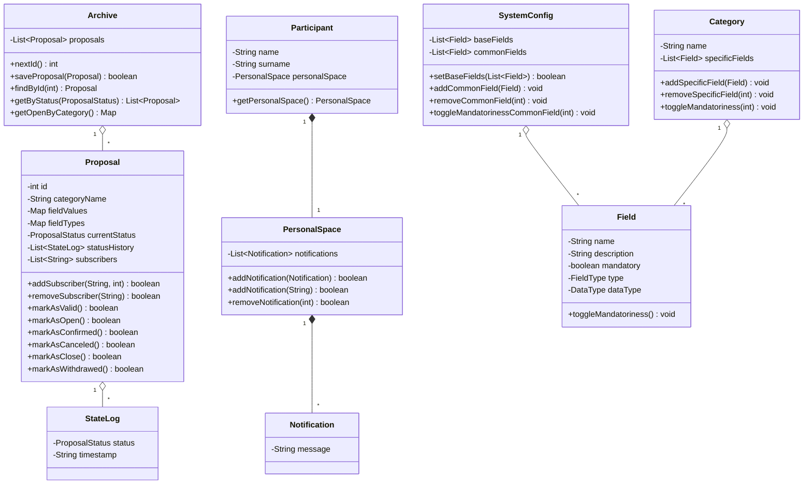

# Valutazione del punto 3: pattern GRASP sulle classi concettuali

## Perimetro

Questa valutazione riguarda il punto 3 della traccia `TestoProgetto2023-24.pdf`: "Applicazione di al piu' due pattern GRASP sulle classi concettuali".

La verifica e' stata svolta sul codice attualmente presente nella repository, tenendo conto della consegna funzionale `Elaborato2025_26_def.pdf`, che descrive un'applicazione stand-alone per la gestione di iniziative ricreative con:

- configuratori, categorie, campi e proposte;
- fruitori, iscrizioni, disiscrizioni e spazio personale;
- stati delle proposte e notifiche automatiche;
- persistenza dei dati applicativi.

Il riferimento teorico per i nomi dei pattern e' `06-Grasp.pdf`, in particolare i pattern `Information Expert`, `Creator` e `Controller`, oltre ai principi valutativi `Low Coupling` e `High Cohesion`.

Poiche' la traccia parla esplicitamente di "classi concettuali", questa valutazione considera come nucleo principale le classi del package `model`. Le classi `controller`, `service`, `persistence`, `ui` e `factory` sono considerate solo quando servono a capire se una responsabilita' e' stata assegnata al dominio oppure spostata altrove.

## Sintesi valutativa

Il punto 3 e' validabile: nel codice sono riconoscibili pattern GRASP applicati alle classi concettuali.

I due pattern GRASP piu' chiaramente applicati sono:

1. `Information Expert`, applicato soprattutto a `Proposal`, `Archive`, `Category`, `SystemConfig`, `PersonalSpace` e `Field`.
2. `Creator`, applicato in modo piu' circoscritto a `Proposal`, `PersonalSpace` e `Participant`.

La valutazione non seleziona `Controller` come uno dei due pattern del punto 3, anche se nel progetto sono presenti controller applicativi (`UserController`, `ConfiguratorController`, `ParticipantController`). Il motivo e' che questi controller appartengono allo strato applicativo/CLI, non alle classi concettuali del dominio. Sono comunque coerenti con il GRASP Controller, ma sono meno adatti a rispondere alla formulazione specifica della traccia.

## Risposta diretta alle tre domande

| Domanda | Valutazione |
| --- | --- |
| I principi/pattern GRASP sono stati applicati? | Si', in modo sostanziale. |
| Quali pattern GRASP sono stati applicati? | Principalmente `Information Expert` e `Creator`. |
| Dove sono stati applicati? | Nel package `model`, in particolare su `Proposal`, `Archive`, `PersonalSpace`, `Participant`, `Category`, `SystemConfig` e `Field`. |

## Mappa delle classi concettuali rilevanti



## Pattern 1: Information Expert

### Valutazione

`Information Expert` e' il GRASP piu' chiaramente applicato nel modello.

Il principio e': assegnare una responsabilita' alla classe che possiede le informazioni necessarie per svolgerla. Nel progetto molte responsabilita' sono collocate proprio nelle classi che possiedono i dati corrispondenti.

### Dove e' applicato

#### `Proposal`

`Proposal` e' responsabile delle operazioni che dipendono dallo stato interno della proposta:

- conosce l'identificativo e la categoria;
- conosce i valori dei campi compilati;
- conosce lo stato corrente;
- conosce la storia degli stati;
- conosce gli iscritti alla proposta.

Per questo motivo e' corretto che sia `Proposal` a gestire:

- aggiunta e rimozione degli iscritti;
- transizioni di stato ammesse;
- registrazione della storia degli stati;
- ricostruzione della data di pubblicazione a partire dalla storia.

Esempio:

```java
// src/it/unibs/ingesw/model/Proposal.java
public boolean addSubscriber(String username, int maxParticipants) {
    ensureSubscribers();
    String normalized = username == null ? null : username.trim();
    if (normalized == null || normalized.isBlank()) {
        return false;
    }
    if (currentStatus != ProposalStatus.OPEN) {
        return false;
    }
    if (maxParticipants <= 0 || subscribers.size() >= maxParticipants) {
        return false;
    }
    for (String subscribed : subscribers) {
        if (subscribed != null && subscribed.equalsIgnoreCase(normalized)) {
            return false;
        }
    }
    subscribers.add(normalized);
    return true;
}
```

Questo metodo e' un buon esempio di `Information Expert`: la proposta possiede la lista degli iscritti e lo stato corrente, quindi puo' decidere se una nuova iscrizione e' compatibile con il proprio stato interno.

Anche le transizioni di stato sono assegnate alla proposta:

```java
// src/it/unibs/ingesw/model/Proposal.java
public boolean markAsConfirmed() {
    if (currentStatus != ProposalStatus.OPEN) {
        return false;
    }
    appendState(ProposalStatus.CONFIRMED);
    return true;
}

private void appendState(ProposalStatus nextStatus) {
    ensureHistory();
    this.currentStatus = nextStatus;
    this.statusHistory.add(new StateLog(nextStatus, LocalDateTime.now()));
}
```

La decisione "da quale stato posso passare a quale altro stato" resta quindi vicina ai dati che la determinano.

#### `Archive`

`Archive` possiede l'elenco delle proposte salvate. Per `Information Expert`, e' corretto che sia responsabile delle operazioni che richiedono la conoscenza dell'intera collezione:

- calcolo del prossimo id disponibile;
- salvataggio o sostituzione di una proposta;
- ricerca per id;
- filtraggio per stato;
- costruzione della bacheca per categoria.

Esempio:

```java
// src/it/unibs/ingesw/model/Archive.java
public Map<String, List<Proposal>> getOpenByCategory() {
    Map<String, List<Proposal>> grouped = new LinkedHashMap<>();
    for (Proposal proposal : getByStatus(ProposalStatus.OPEN)) {
        String categoryName = proposal.getCategoryName();
        if (categoryName == null || categoryName.isBlank()) {
            categoryName = UNTITLED_CATEGORY;
        }
        grouped.computeIfAbsent(categoryName, _ -> new ArrayList<>()).add(proposal);
    }

    Map<String, List<Proposal>> immutable = new LinkedHashMap<>();
    for (Map.Entry<String, List<Proposal>> entry : grouped.entrySet()) {
        immutable.put(entry.getKey(), Collections.unmodifiableList(entry.getValue()));
    }
    return Collections.unmodifiableMap(immutable);
}
```

La bacheca e' una vista delle proposte aperte, ma il raggruppamento nasce dai dati contenuti nell'archivio. Quindi `Archive` e' un buon esperto per questa responsabilita'.

#### `Category`, `SystemConfig` e `Field`

`Category` possiede i campi specifici della categoria e gestisce aggiunta, rimozione e cambio di obbligatorieta' di tali campi:

```java
// src/it/unibs/ingesw/model/Category.java
public void toggleMandatoriness(int index) {
    ensureSpecificFields();
    specificFields.get(index).toggleMandatoriness();
}
```

`SystemConfig` possiede campi base e campi comuni, quindi gestisce le operazioni sul loro insieme:

```java
// src/it/unibs/ingesw/model/SystemConfig.java
public boolean setBaseFields(List<Field> baseFields) {
    if (areBaseFieldsSet()) {
        return false;
    }
    this.baseFields = new ArrayList<>(baseFields);
    return true;
}
```

`Field` possiede il flag `mandatory`, quindi e' corretto che sia la classe `Field` a modificarlo:

```java
// src/it/unibs/ingesw/model/Field.java
public void toggleMandatoriness() {
    mandatory = !mandatory;
}
```

Questi tre casi sono semplici ma significativi: ogni oggetto manipola lo stato che gli appartiene.

#### `PersonalSpace`

`PersonalSpace` possiede l'elenco delle notifiche ricevute dal fruitore. Per questo e' corretto che sia responsabile di aggiungere e rimuovere notifiche:

```java
// src/it/unibs/ingesw/model/PersonalSpace.java
public boolean removeNotification(int index) {
    ensureNotifications();
    if (index < 0 || index >= notifications.size()) {
        return false;
    }
    notifications.remove(index);
    return true;
}
```

Anche questo e' un caso diretto di `Information Expert`: solo lo spazio personale conosce la propria lista di notifiche e puo' validare l'indice rispetto a quella lista.

### Valutazione complessiva di Information Expert

L'applicazione di `Information Expert` e' buona.

Le classi del modello non sono semplici strutture dati passive: contengono comportamenti coerenti con le informazioni che possiedono. Questo e' particolarmente evidente in `Proposal` e `Archive`, che sono le classi piu' centrali rispetto ai requisiti della consegna.

## Pattern 2: Creator

### Valutazione

`Creator` e' applicato, ma in modo piu' circoscritto rispetto a `Information Expert`.

Il principio e': assegnare a una classe `B` la responsabilita' di creare istanze di `A` quando `B` contiene, aggrega, registra, usa strettamente `A` oppure possiede i dati per inizializzarlo.

Nel progetto i casi piu' chiari sono nel modello:

- `Proposal` crea `StateLog`;
- `PersonalSpace` crea `Notification`;
- `Participant` crea `PersonalSpace`.

### Dove e' applicato

#### `Proposal` crea `StateLog`

`Proposal` contiene la lista `statusHistory` e ogni cambio di stato deve essere registrato con un oggetto `StateLog`.

```java
// src/it/unibs/ingesw/model/Proposal.java
private void appendState(ProposalStatus nextStatus) {
    ensureHistory();
    this.currentStatus = nextStatus;
    this.statusHistory.add(new StateLog(nextStatus, LocalDateTime.now()));
}
```

Questo e' un caso forte di `Creator`:

- `Proposal` contiene molti `StateLog`;
- `Proposal` registra ogni passaggio di stato;
- `Proposal` possiede il nuovo stato da registrare;
- `Proposal` e' il punto in cui il timestamp della transizione ha significato.

La creazione di `StateLog` dentro `Proposal` evita che servizi o controller debbano conoscere i dettagli della storia interna della proposta.

#### `PersonalSpace` crea `Notification`

`PersonalSpace` contiene notifiche. Oltre a ricevere una `Notification` gia' creata, offre un metodo che crea una notifica a partire dal messaggio:

```java
// src/it/unibs/ingesw/model/PersonalSpace.java
public boolean addNotification(String message) {
    String normalized = message == null ? null : message.trim();
    if (normalized == null || normalized.isBlank()) {
        return false;
    }
    return addNotification(new Notification(normalized));
}
```

Anche questo e' coerente con `Creator`:

- `PersonalSpace` aggrega le notifiche;
- `PersonalSpace` valida il messaggio prima di inserirlo;
- la notifica creata viene immediatamente registrata nello spazio personale.

#### `Participant` crea `PersonalSpace`

`Participant` possiede uno spazio personale. Quando non ne riceve uno gia' ricostruito dalla persistenza, crea il proprio `PersonalSpace`:

```java
// src/it/unibs/ingesw/model/Participant.java
public Participant(
        String name,
        String surname,
        String username,
        String password,
        PersonalSpace personalSpace
) {
    super(username, password);
    this.name = name;
    this.surname = surname;
    this.personalSpace = personalSpace == null ? new PersonalSpace() : personalSpace;
}
```

Questo caso e' coerente con `Creator` perche' `Participant` possiede stabilmente il proprio spazio personale.

### Casi collegati ma meno forti

Nel progetto esistono anche creazioni di oggetti di dominio dentro i servizi:

```java
// src/it/unibs/ingesw/service/ProposalService.java
Proposal proposal = new Proposal(archive.nextId(), category.getName(), normalized, fieldTypes);
```

```java
// src/it/unibs/ingesw/service/ConfigurationService.java
categories.add(new Category(normalized, validSpecifics));
```

```java
// src/it/unibs/ingesw/service/AuthenticationService.java
Participant participant = new Participant(normalizedName, normalizedSurname, normalizedUsername, password);
```

Questi casi sono ragionevoli dal punto di vista applicativo, perche' i servizi coordinano input, validazione, collezioni condivise e persistenza. Tuttavia sono meno forti come esempi di `Creator` "sulle classi concettuali", perche' il creatore non e' una classe del modello ma un servizio applicativo.

Si possono leggere come scelta orientata a `Low Coupling` e `High Cohesion`: i servizi evitano di caricare le entita' di dominio con responsabilita' di orchestrazione, validazione esterna e scrittura su repository.

### Valutazione complessiva di Creator

`Creator` e' applicato in modo valido nei casi in cui una classe concettuale crea oggetti che possiede o registra direttamente.

Non tutte le creazioni del dominio sono pero' assegnate a classi concettuali. Alcune sono assegnate a servizi applicativi, scelta accettabile ma da non presentare come esempio principale del pattern `Creator` richiesto dal punto 3.

## Pattern non selezionato: Controller

Il codice contiene classi che rispettano l'idea del GRASP `Controller`:

- `UserController` riceve e coordina l'operazione di accesso all'applicazione;
- `ConfiguratorController` coordina i casi d'uso del back-end configuratore;
- `ParticipantController` coordina i casi d'uso del front-end fruitore.

Esempio:

```java
// src/it/unibs/ingesw/controller/ParticipantController.java
private void subscribeToOpenProposal(Participant participant) {
    proposalLifecycleService.refreshProposalLifecycle();
    List<Proposal> openProposals = proposalService.getOpenProposals();
    int index = interaction.chooseOpenProposal(openProposals);
    if (index < 0) {
        return;
    }

    Proposal selected = openProposals.get(index);
    boolean subscribed = proposalService.subscribeParticipantToProposal(participant, selected.getId());
    interaction.printSubscriptionResult(subscribed);
}
```

Questo e' coerente con il GRASP `Controller`, perche' il controller riceve l'evento di sistema dalla UI e coordina le classi applicative senza stampare direttamente tutto o manipolare file.

Tuttavia, per il punto 3 conviene non usarlo come uno dei due pattern principali, per due motivi:

1. La traccia parla di classi concettuali.
2. Il pattern `Controller` e' gia' piu' vicino alla separazione modello-vista e allo strato applicativo che al modello concettuale.

Per una presentazione, puo' essere citato come nota architetturale, ma non come uno dei "due pattern GRASP sulle classi concettuali".

## Limiti e osservazioni critiche

### Alcune regole di dominio sono fuori da `Proposal`

`Proposal` gestisce gli stati e gli iscritti, ma molte regole di dominio sono in `ProposalRuleValidator` e `ProposalLifecycleService`.

Esempi:

- controllo delle date base;
- controllo della finestra di iscrizione;
- controllo della possibilita' di ritirare una proposta;
- decisione automatica tra conferma e annullamento dopo la scadenza.

Questo riduce in parte la purezza di `Information Expert`, perche' molte informazioni sono in `Proposal`, ma alcune decisioni sono in servizi esterni.

La scelta e' comunque difendibile: i campi della proposta sono dinamici e salvati come `Map<String, String>`, quindi il significato di campi come `"Data"`, `"Data conclusiva"` e `"Numero di partecipanti"` non e' modellato con attributi tipizzati dentro `Proposal`. Centralizzare queste regole in un validator mantiene `Proposal` piu' coesa e limita l'accoppiamento con la semantica dei campi configurabili.

### `Creator` non e' sempre applicato tramite classi concettuali

La creazione di `Proposal`, `Category`, `Participant`, `Field` e `Configurator` avviene spesso nei servizi o nei controller.

Questo non e' necessariamente sbagliato, ma per il punto 3 e' meglio evitare di presentare questi casi come esempi principali di `Creator` sulle classi concettuali. Gli esempi piu' puliti sono invece:

- `Proposal -> StateLog`;
- `PersonalSpace -> Notification`;
- `Participant -> PersonalSpace`.

### I servizi sostengono indirettamente Low Coupling e High Cohesion

Anche se questa valutazione seleziona solo `Information Expert` e `Creator`, il progetto mostra attenzione anche a `Low Coupling` e `High Cohesion`:

- la persistenza e' fuori dal modello;
- le regole di validazione sono in servizi dedicati;
- i controller delegano a servizi e vista;
- il modello non importa `ui`, `console`, `controller`, `service` o `persistence`.

Questi principi rafforzano la valutazione, ma non vengono contati come pattern principali per rispettare il vincolo "al piu' due".

## Valutazione finale

Il punto 3 di `TestoProgetto2023-24.pdf` e' validabile.

La formulazione consigliata per la presentazione e':

- `Information Expert` e' applicato alle classi concettuali che possiedono le informazioni rilevanti, in particolare `Proposal`, `Archive`, `Category`, `SystemConfig`, `PersonalSpace` e `Field`.
- `Creator` e' applicato nei casi in cui una classe concettuale crea oggetti che possiede o registra direttamente, in particolare `Proposal` con `StateLog`, `PersonalSpace` con `Notification` e `Participant` con `PersonalSpace`.

La valutazione piu' forte e' su `Information Expert`; la valutazione su `Creator` e' positiva ma piu' circoscritta. I casi di creazione demandati ai servizi non annullano il pattern, ma vanno presentati come scelta di progettazione per mantenere coesione e basso accoppiamento, non come esempi principali di `Creator` sulle classi concettuali.
