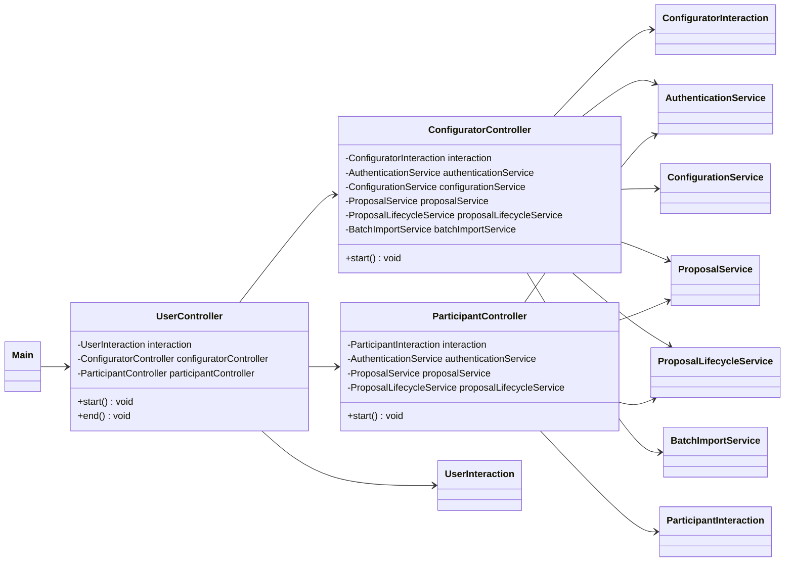
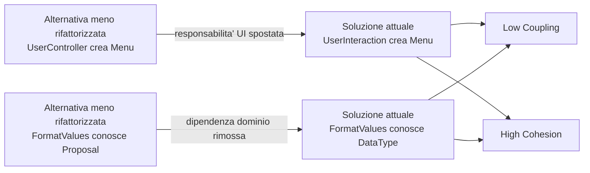

# Valutazione GRASP 2: Controller, responsabilita' riassegnate e confronto progettuale

## Perimetro

Questa seconda valutazione integra `VALUTAZIONE_GRASP.md` e risponde in modo mirato a quattro punti:

- quali classi sono `Controller` GRASP e perche';
- come leggere con pattern GRASP le responsabilita' riassegnate nel codice rifattorizzato;
- come usare `Low Coupling` e `High Cohesion` per confrontare due scelte progettuali;
- quali pattern GRASP erano gia' riconoscibili sulle responsabilita' assegnate nella prima parte del progetto.

Il riferimento principale e' il codice attualmente presente nella repo, letto come risultato complessivo delle responsabilita' assegnate e riassegnate durante l'evoluzione del progetto.

Quando viene fatto un confronto "prima/dopo", esso va inteso come confronto tra due alternative progettuali, non come confronto cronologico tra revisioni della repository:

- una scelta progettuale meno rifattorizzata, in cui una responsabilita' resta assegnata a una classe meno adatta;
- la scelta progettuale attualmente adottata nel codice, in cui la responsabilita' e' assegnata a una classe piu' coerente secondo GRASP.

## Sintesi valutativa

Le classi `Controller` GRASP del progetto sono:

1. `UserController`, controller facade dell'applicazione CLI.
2. `ConfiguratorController`, controller dei casi d'uso del back-end configuratore.
3. `ParticipantController`, controller dei casi d'uso del front-end fruitore.

La responsabilita' principale di queste classi e' ricevere gli eventi di sistema prodotti dall'interazione utente, coordinare il caso d'uso e delegare il lavoro a vista, servizi e modello. Questa e' la forma piu' riconoscibile del pattern GRASP `Controller`.

Nel codice attuale le riassegnazioni piu' rilevanti per GRASP non riguardano nuove funzionalita', ma responsabilita' tecniche e di coordinamento:

- `UserInteraction` diventa responsabile anche del menu di accesso, perche' e' una responsabilita' di vista.
- `FormatValues` torna a essere una `Pure Fabrication` tecnica di formattazione, non piu' accoppiata a `Proposal`.

Queste riassegnazioni migliorano `Low Coupling` e `High Cohesion`.

## Mappa dei controller GRASP



Questa mappa mostra il punto centrale del pattern: i controller non sono il modello e non sono la vista; sono oggetti di coordinamento.

## 1. Quali classi sono Controller GRASP e perche'

### `UserController`

`UserController` e' il controller GRASP di livello piu' alto. Rappresenta l'intero sistema dal punto di vista della sessione CLI.

E' un `Controller` perche':

- riceve l'avvio del flusso applicativo da `Main`;
- mostra l'accesso alle due aree operative tramite la vista;
- decide se instradare l'utente verso back-end configuratore o front-end fruitore;
- delega ai controller piu' specifici senza gestire direttamente i dettagli dei casi d'uso.

Codice attuale:

```java
// src/it/unibs/ingesw/controller/UserController.java
public void start() {
    interaction.clearConsole();
    interaction.printBanner();
    interaction.printApplicationTitle();

    boolean exit = false;
    while (!exit) {
        int choice = interaction.chooseAccessArea();
        switch (choice) {
            case 0 -> exit = true;
            case 1 -> configuratorController.start();
            case 2 -> participantController.start();
            default -> {
                // Menu already validates options; defensive fallback.
            }
        }
    }
}
```

La responsabilita' assegnata a `UserController` e' corretta: non crea menu direttamente e non applica regole di dominio, ma coordina il passaggio di controllo.

### `ConfiguratorController`

`ConfiguratorController` e' un controller GRASP per i casi d'uso del configuratore.

E' un `Controller` perche':

- riceve gli eventi del back-end configuratore;
- mantiene il flusso del caso d'uso, ad esempio login, primo accesso, configurazione campi, gestione categorie, proposte, archivio e import batch;
- coordina vista e servizi;
- delega regole, persistenza e lifecycle ai servizi.

Esempio:

```java
// src/it/unibs/ingesw/controller/ConfiguratorController.java
private void createProposal() {
    List<Category> categories = configurationService.getCategories();
    if (categories.isEmpty()) {
        interaction.printNoCategoryAvailable();
        return;
    }

    int categoryIndex = interaction.chooseIndex(
            categories,
            interaction.categorySelectionTitle(),
            Category::getName
    );
    if (categoryIndex < 0) {
        return;
    }

    Category category = categories.get(categoryIndex);
    List<Field> fields = configurationService.getSharedFieldsForCategory(category);
    Map<String, String> rawValues = new LinkedHashMap<>();

    for (Field field : fields) {
        if (!field.isMandatory() && !interaction.askFillOptionalField(field.getName())) {
            continue;
        }
        rawValues.put(field.getName(), interaction.readFieldValue(field));
    }

    Proposal proposal = proposalService.createProposal(categoryIndex, rawValues);
    // stampa dell'esito delegata alla interaction
}
```

Qui il controller non normalizza i valori, non valida le date, non salva direttamente su file e non cambia direttamente lo stato persistente. Coordina il caso d'uso e delega.

### `ParticipantController`

`ParticipantController` e' un controller GRASP per i casi d'uso del fruitore.

E' un `Controller` perche':

- riceve gli eventi del front-end fruitore;
- gestisce login, registrazione, visualizzazione bacheca, iscrizione, disiscrizione e spazio personale;
- coordina `ParticipantInteraction`, `AuthenticationService`, `ProposalService` e `ProposalLifecycleService`;
- non contiene direttamente la logica di iscrizione o di notifica.

Esempio:

```java
// src/it/unibs/ingesw/controller/ParticipantController.java
private void subscribeToOpenProposal(Participant participant) {
    proposalLifecycleService.refreshProposalLifecycle();
    List<Proposal> openProposals = proposalService.getOpenProposals();
    int index = interaction.chooseOpenProposal(openProposals);
    if (index < 0) {
        return;
    }

    Proposal selected = openProposals.get(index);
    boolean subscribed = proposalService.subscribeParticipantToProposal(participant, selected.getId());
    interaction.printSubscriptionResult(subscribed);
}
```

Anche qui la responsabilita' e' di coordinamento: il controller sceglie il flusso, il servizio applica le regole, la vista comunica con l'utente.

### Classi non considerate Controller GRASP principali

`ApplicationContext` non e' un `Controller` GRASP: e' una composition root. Costruisce repository e servizi, ma non riceve eventi di sistema da UI.

I servizi (`ProposalService`, `ConfigurationService`, `AuthenticationService`, ecc.) possono sembrare controller di caso d'uso, ma nel progetto sono piu' precisamente servizi applicativi. Ricevono chiamate dai controller e implementano casi d'uso o regole applicative; non sono il primo oggetto oltre la UI che riceve l'evento dell'utente.

## 2. Pattern GRASP sulle responsabilita' riassegnate nel codice attuale

Nel codice attualmente presente nella repository si riconoscono alcune responsabilita' assegnate a classi piu' adatte rispetto a una distribuzione meno rifattorizzata. Queste assegnazioni si leggono bene con tre principi/pattern GRASP:

- `Controller`, per mantenere i controller concentrati sul coordinamento;
- `Pure Fabrication`, per isolare funzioni tecniche non appartenenti al dominio;
- `Low Coupling` e `High Cohesion`, per valutare il miglioramento.

### Riassegnazione 1: menu di accesso da `UserController` a `UserInteraction`

In una scelta meno rifattorizzata, `UserController` potrebbe contenere direttamente i dettagli del menu:

```java
// Alternativa meno coesa: dettagli di vista dentro il controller
private static final String ACCESS_MENU_TITLE = "Area di Accesso";
private static final List<String> ACCESS_MENU_ENTRIES = List.of(
        "Backend Configuratore",
        "Frontend Fruitore"
);

private int chooseAccessArea() {
    return new Menu(ACCESS_MENU_TITLE, ACCESS_MENU_ENTRIES, true, Alignment.CENTER, true).choose();
}
```

Nel codice attuale, invece, il controller delega la scelta alla vista:

```java
// src/it/unibs/ingesw/controller/UserController.java
while (!exit) {
    int choice = interaction.chooseAccessArea();
    switch (choice) {
        case 0 -> exit = true;
        case 1 -> configuratorController.start();
        case 2 -> participantController.start();
        default -> {
            // Menu already validates options; defensive fallback.
        }
    }
}
```

La responsabilita' e' stata spostata in `UserInteraction`:

```java
// src/it/unibs/ingesw/ui/UserInteraction.java
public int chooseAccessArea() {
    return new Menu(ACCESS_MENU_TITLE, ACCESS_MENU_ENTRIES, true, Alignment.CENTER, true).choose();
}
```

Valutazione GRASP:

- `Controller`: `UserController` resta responsabile del coordinamento dell'evento, non della costruzione della vista.
- `High Cohesion`: `UserInteraction` raccoglie responsabilita' di interazione CLI; `UserController` raccoglie responsabilita' di routing.
- `Low Coupling`: `UserController` non dipende piu' da `Menu`, `Alignment` e `List` per costruire la UI.

### Riassegnazione 2: formattazione sganciata da `Proposal`

In una scelta meno disaccoppiata, `FormatValues` potrebbe conoscere direttamente `Proposal`:

```java
// Alternativa meno disaccoppiata: il formatter conosce Proposal
public static String formatField(Proposal proposal, String fieldName, String rawValue) {
    if (proposal == null)
        return rawValue;

    DataType type = proposal.getFieldType(fieldName);
    return formatByType(type, rawValue);
}
```

Nel codice attuale, invece, `FormatValues` formatta solo in base a `DataType` e valore grezzo:

```java
// src/it/unibs/ingesw/console/format/FormatValues.java
public static String formatByType(DataType type, String rawValue) {
    if (rawValue == null)
        return EMPTY_VALUE;

    if (type == null)
        return rawValue;

    try {
        return switch (type) {
            case DATE -> formatDate(rawValue);
            case TIME -> formatTime(rawValue);
            case BOOLEAN -> formatBoolean(rawValue);
            case DECIMAL -> formatCurrency(rawValue);
            default -> rawValue;
        };
    } catch (DateTimeParseException | NumberFormatException e) {
        return rawValue;
    }
}
```

La vista recupera il tipo dalla proposta e passa a `FormatValues` solo l'informazione tecnica necessaria:

```java
// src/it/unibs/ingesw/ui/UserInteraction.java
String formattedValue = FormatValues.formatByType(
        proposal.getFieldType(valueEntry.getKey()),
        valueEntry.getValue()
);
```

Valutazione GRASP:

- `Pure Fabrication`: `FormatValues` e' una classe artificiale tecnica, creata per una responsabilita' coesa di formattazione.
- `Low Coupling`: `FormatValues` non dipende piu' dalla classe concettuale `Proposal`.
- `High Cohesion`: `FormatValues` non miscela piu' accesso ai dati della proposta e formattazione; si occupa solo di convertire valori.
- `Information Expert`: la conoscenza del tipo del campo resta in `Proposal`, che possiede `fieldTypes`; la vista chiede questa informazione all'oggetto esperto e poi delega la presentazione al formatter.

## 3. Low Coupling e High Cohesion: confronto tra scelte progettuali

### Scelta progettuale A: menu di accesso

| Aspetto | Scelta meno rifattorizzata | Scelta attuale nella repo |
| --- | --- | --- |
| Responsabilita' del controller | `UserController` coordinava il flusso e costruiva direttamente il menu CLI. | `UserController` coordina il flusso e chiede a `UserInteraction` di gestire il menu. |
| Accoppiamento | `UserController` dipendeva da `Menu`, `Alignment`, `List` e costanti di presentazione. | `UserController` dipende solo da `UserInteraction` e dai controller figli. |
| Coesione | Meno alta: routing applicativo e dettagli di vista convivevano nella stessa classe. | Piu' alta: routing in `UserController`, interazione CLI in `UserInteraction`. |
| Valutazione GRASP | Controller parzialmente appesantito da responsabilita' di vista. | Controller piu' pulito; vista piu' coesa. |

Conclusione: la scelta attuale e' migliore per `Low Coupling` e `High Cohesion`.

### Scelta progettuale B: formattazione dei valori di una proposta

| Aspetto | Scelta meno rifattorizzata | Scelta attuale nella repo |
| --- | --- | --- |
| Responsabilita' di `FormatValues` | Formattava valori e conosceva direttamente `Proposal`. | Formatta valori conoscendo solo `DataType` e stringa grezza. |
| Accoppiamento | `console.format` dipendeva da una classe del dominio (`Proposal`). | `console.format` dipende solo da `DataType`, informazione piu' stabile e minimale. |
| Coesione | Meno alta: il formatter recuperava metadati dal dominio e formattava. | Piu' alta: il formatter e' una utility tecnica focalizzata sulla formattazione. |
| Effetto sulla vista | La vista delegava troppo al formatter. | La vista compone le informazioni di presentazione e usa il formatter come supporto tecnico. |

Conclusione: la scelta attuale riduce l'accoppiamento fra console e dominio e rende `FormatValues` piu' coesa.

### Sintesi del confronto



La soluzione attuale e' coerente con i due criteri GRASP valutativi:

- abbassa l'accoppiamento dei controller e delle utility di formattazione;
- aumenta la coesione di vista, controller e formatter.

## 4. Pattern GRASP sulle responsabilita' assegnate nella prima parte del progetto

Per "prima parte del progetto" si intendono le responsabilita' legate alle funzionalita' di base gia' richieste prima degli approfondimenti di refactoring: configurazione di campi e categorie, creazione e pubblicazione di proposte, accesso dei ruoli applicativi, bacheca, iscrizioni, stati e persistenza.

Nel codice attualmente presente nella repository queste responsabilita' sono ancora riconoscibili e permettono di individuare diversi pattern GRASP.

### `Information Expert`

`Information Expert` era gia' applicato nelle classi concettuali principali.

| Classe | Responsabilita' | Perche' e' Expert |
| --- | --- | --- |
| `Proposal` | Gestire stato corrente, storia degli stati, iscritti, aggiunta/rimozione iscritti e transizioni ammesse. | Possiede `currentStatus`, `statusHistory`, `subscribers`, `fieldValues` e `fieldTypes`. |
| `Archive` | Calcolare prossimo id, salvare/sostituire proposte, cercare per id, filtrare per stato, costruire la bacheca. | Possiede l'elenco completo delle proposte. |
| `PersonalSpace` | Aggiungere e rimuovere notifiche. | Possiede la lista delle notifiche del fruitore. |
| `Category` | Gestire i campi specifici della categoria. | Possiede la lista dei campi specifici. |
| `SystemConfig` | Gestire campi base e comuni. | Possiede le liste di campi condivisi. |
| `Field` | Cambiare il flag di obbligatorieta'. | Possiede direttamente il flag `mandatory`. |

Esempio:

```java
// src/it/unibs/ingesw/model/Proposal.java
public boolean markAsOpen() {
    if (currentStatus != ProposalStatus.VALID) {
        return false;
    }
    appendState(ProposalStatus.OPEN);
    return true;
}
```

La responsabilita' della transizione e' assegnata alla proposta, che conosce il proprio stato.

### `Creator`

`Creator` era gia' riconoscibile in alcune creazioni interne al modello.

| Creatore | Oggetto creato | Motivazione GRASP |
| --- | --- | --- |
| `Proposal` | `StateLog` | `Proposal` contiene e registra la storia degli stati. |
| `PersonalSpace` | `Notification` | `PersonalSpace` contiene notifiche e valida il messaggio prima dell'inserimento. |
| `Participant` | `PersonalSpace` | `Participant` possiede stabilmente il proprio spazio personale. |

Esempio:

```java
// src/it/unibs/ingesw/model/Proposal.java
private void appendState(ProposalStatus nextStatus) {
    ensureHistory();
    this.currentStatus = nextStatus;
    this.statusHistory.add(new StateLog(nextStatus, LocalDateTime.now()));
}
```

Questo e' un caso chiaro di `Creator`: la proposta crea il log che essa stessa contiene.

### `Controller`

Sulle responsabilita' della prima parte sono presenti controller GRASP:

- `UserController` come facade controller della sessione applicativa;
- `ConfiguratorController` come controller dei casi d'uso del configuratore;
- `ParticipantController` come controller dei casi d'uso del fruitore.

Nel codice attuale questi controller restano principalmente oggetti di coordinamento. I dettagli di input/output sono delegati alle classi `Interaction`, mentre le regole applicative sono delegate ai servizi.

### `Pure Fabrication`

Alcune responsabilita' della prima parte non appartenevano naturalmente alle classi concettuali. Il progetto le assegna a classi artificiali e coese, riconducibili a `Pure Fabrication`.

| Classe | Responsabilita' artificiale | Perche' non e' una classe concettuale pura |
| --- | --- | --- |
| `ProposalRuleValidator` | Validare regole temporali e numeriche delle proposte. | Evita di appesantire `Proposal` con parsing e semantica dei campi configurabili. |
| `ProposalValueNormalizer` | Convertire input utente in valori canonici. | Normalizzazione tecnica, non concetto del dominio. |
| `NotificationService` | Trovare iscritti e consegnare notifiche. | Responsabilita' applicativa trasversale fra proposte e fruitori. |
| Repository JSON | Leggere/scrivere file JSON. | Persistenza tecnica, non responsabilita' del modello. |
| `FormatValues` | Formattare valori per la CLI. | Presentazione tecnica, non concetto del dominio. |

Queste classi sostengono `Low Coupling` e `High Cohesion`, perche' evitano che `Proposal`, `Participant`, `Archive` o i controller diventino classi troppo grandi e troppo dipendenti da dettagli tecnici.

## Valutazione finale

La seconda valutazione conferma che il progetto usa GRASP non solo nelle classi concettuali, ma anche nell'assegnazione delle responsabilita' tra controller, vista, servizi e utility tecniche.

Risposte sintetiche:

- Le classi `Controller` GRASP sono `UserController`, `ConfiguratorController` e `ParticipantController`, perche' ricevono gli eventi di sistema dalla UI e coordinano i casi d'uso.
- Nel codice attuale, il menu di accesso e' assegnato alla vista (`UserInteraction`) e la formattazione e' una responsabilita' tecnica piu' pura (`FormatValues` senza dipendenza da `Proposal`).
- Il confronto tra scelte progettuali mostra miglioramenti in `Low Coupling` e `High Cohesion`: meno dipendenze dai dettagli CLI nei controller e meno dipendenze dal dominio nelle utility di formattazione.
- Nelle responsabilita' della prima parte sono riconoscibili `Information Expert`, `Creator`, `Controller` e diverse `Pure Fabrication`.
