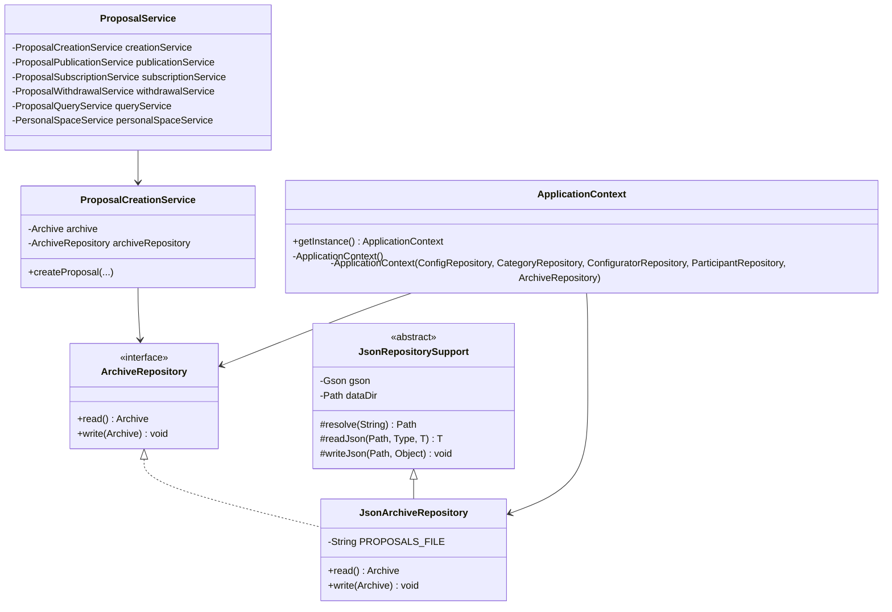
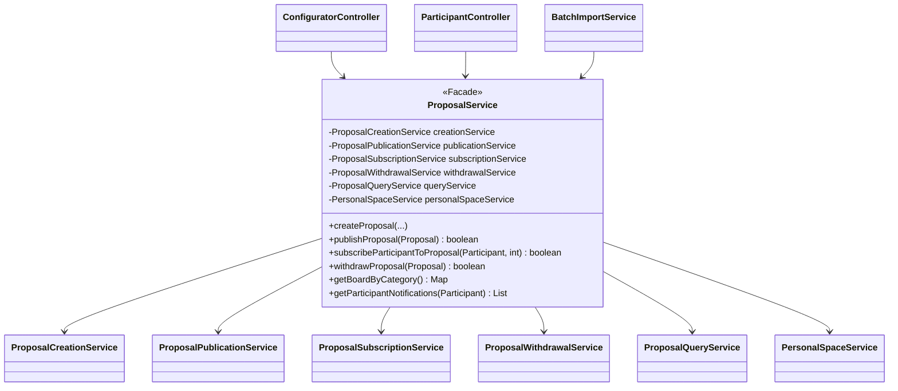

# Valutazione del punto 5: pattern GoF sulle classi del progetto

## Perimetro

Questa valutazione riguarda il punto 5 della traccia `TestoProgetto2023-24.pdf`: "Applicazione di al piu' due pattern GoF sulle classi del progetto".

La verifica e' stata svolta sul codice attualmente presente nella repository, tenendo conto della consegna funzionale `Elaborato2025_26_def.pdf`, che descrive un'applicazione stand-alone Java per:

- configurare categorie e campi di iniziative;
- creare, pubblicare, archiviare, confermare, annullare e ritirare proposte;
- gestire iscrizioni e disiscrizioni dei fruitori;
- notificare automaticamente i fruitori iscritti;
- salvare in modo persistente configurazioni, utenti, categorie e proposte.

Il riferimento teorico e' il materiale GoF allegato, in particolare `08-GoF_parte1.pdf` e `09-GoF_parte2.pdf`. Nel documento viene mantenuta una distinzione importante:

- secondo la classificazione didattica delle slide, nel progetto sono riconoscibili `Repository` e `Facade`;
- in senso GoF strettamente canonico, `Facade` e' uno dei 23 pattern originali della Gang of Four, mentre `Repository` non lo e': e' pero' trattato nelle slide GoF del corso ed e' il pattern piu' evidente nella persistenza del progetto;
- `Singleton` e `Factory Method` sono ora applicati nel codice, ma vengono documentati come "safety net" e non selezionati come i due pattern principali, cosi' da mantenere il focus su `Repository` e `Facade`.

Per la presentazione del punto 5 conviene quindi dichiarare esplicitamente questa assunzione: si stanno usando i pattern trattati nel blocco didattico sui GoF, non solo l'elenco canonico dei 23 pattern del libro.

## Sintesi valutativa

Il punto 5 e' validabile.

Nel codice sono riconoscibili due pattern applicati in modo utile al progetto:

1. `Repository`, applicato nel package `persistence` per isolare la persistenza JSON dal resto dell'applicazione.
2. `Facade`, applicato in `src/it/unibs/ingesw/service/proposal/ProposalService.java` per offrire ai controller e ai flussi di importazione un'API compatta sui casi d'uso delle proposte.

Il primo e' applicato in modo forte e strutturale: servizi e application context dipendono da interfacce di repository, mentre i dettagli JSON sono confinati nelle implementazioni concrete.

Il secondo e' ora applicato in modo sostanziale: `ProposalService` espone un'interfaccia pubblica stabile e delega internamente a servizi piu' piccoli e package-private (`ProposalCreationService`, `ProposalPublicationService`, `ProposalSubscriptionService`, `ProposalWithdrawalService`, `ProposalQueryService`, `PersonalSpaceService`). Questa struttura corrisponde meglio al pattern GoF `Facade` rispetto alla valutazione precedente.

Sono inoltre applicati due pattern aggiuntivi utili come rete di sicurezza:

- `Singleton`, applicato a `ApplicationContext` e alle tre factory concrete delle notifiche tramite `getInstance()` e lazy holder;
- `Factory Method`, applicato alle notifiche tramite l'interfaccia `NotificationFactory` e le factory concrete per conferma, annullamento e ritiro.

## Risposta diretta alle tre domande

| Domanda | Valutazione |
| --- | --- |
| I pattern sono stati applicati? | Si', considerando i pattern trattati nelle slide GoF del corso. |
| Quali pattern sono stati applicati? | `Repository` e `Facade`. |
| Dove sono stati applicati? | `Repository` nel package `persistence` e nei servizi che usano le relative interfacce; `Facade` in `service.proposal.ProposalService`, che nasconde i servizi specializzati del package `service.proposal`. |

## Mappa complessiva

```mermaid
flowchart LR
    Controller["controller<br/>ConfiguratorController<br/>ParticipantController"]
    Import["service<br/>BatchImportService"]
    AppService["service<br/>AuthenticationService<br/>ConfigurationService"]
    Facade["service.proposal<br/>ProposalService<br/>(Facade)"]
    ProposalInternals["service.proposal package-private<br/>ProposalCreationService<br/>ProposalPublicationService<br/>ProposalSubscriptionService<br/>ProposalWithdrawalService<br/>ProposalQueryService<br/>PersonalSpaceService"]
    Lifecycle["service.proposal<br/>ProposalLifecycleService"]
    RepoIf["persistence interfaces<br/>ConfigRepository<br/>CategoryRepository<br/>ConfiguratorRepository<br/>ParticipantRepository<br/>ArchiveRepository"]
    JsonRepo["persistence JSON<br/>JsonConfigRepository<br/>JsonCategoryRepository<br/>JsonConfiguratorRepository<br/>JsonParticipantRepository<br/>JsonArchiveRepository"]
    Model["model<br/>SystemConfig, Category, User,<br/>Participant, Archive, Proposal"]
    Factory["factory<br/>NotificationFactory<br/>Proposal*NotificationFactory<br/>(Factory Method + Singleton creator)"]
    Singleton["application<br/>ApplicationContext<br/>(Singleton)"]
    Data["data/*.json"]

    Controller --> AppService
    Controller --> Facade
    Controller --> Lifecycle
    Controller --> Singleton
    Import --> Facade
    Facade --> ProposalInternals
    ProposalInternals --> Model
    ProposalInternals --> RepoIf
    Lifecycle --> Model
    Lifecycle --> RepoIf
    RepoIf <|.. JsonRepo
    JsonRepo --> Data
    ProposalInternals --> Factory
    Lifecycle --> Factory
    Factory --> Model
    Singleton --> AppService
    Singleton --> Facade
    Singleton --> Lifecycle
```

I due punti piu' rilevanti sono:

- i servizi non conoscono `Gson`, `Files`, `Path` o nomi di file JSON: parlano con interfacce come `ArchiveRepository`;
- i controller e `BatchImportService` non devono conoscere i servizi interni di gestione delle proposte: parlano con la facade pubblica `ProposalService`.

## Pattern 1: Repository

### Valutazione

`Repository` e' applicato in modo sostanziale.

La consegna 2025-26 richiede persistenza dei dati applicativi ma non impone un DBMS. Il codice sceglie file JSON e protegge il resto dell'applicazione da questa scelta attraverso interfacce di repository.

Le classi di dominio e i controller non leggono e scrivono direttamente file. Le operazioni di persistenza sono nascoste dietro oggetti repository, che danno al resto del sistema l'illusione di lavorare con collezioni o aggregati gia' disponibili in memoria.

### Dove e' applicato

Il pattern e' applicato nel package `src/it/unibs/ingesw/persistence`:

- `ConfigRepository` / `JsonConfigRepository`;
- `CategoryRepository` / `JsonCategoryRepository`;
- `ConfiguratorRepository` / `JsonConfiguratorRepository`;
- `ParticipantRepository` / `JsonParticipantRepository`;
- `ArchiveRepository` / `JsonArchiveRepository`;
- `JsonRepositorySupport`, che raccoglie il codice comune di lettura/scrittura JSON.

Le interfacce definiscono il contratto di accesso ai dati:

```java
// src/it/unibs/ingesw/persistence/ArchiveRepository.java
public interface ArchiveRepository {
    Archive read();
    void write(Archive archive);
}
```

L'implementazione concreta nasconde il formato JSON e il nome del file:

```java
// src/it/unibs/ingesw/persistence/JsonArchiveRepository.java
public class JsonArchiveRepository extends JsonRepositorySupport implements ArchiveRepository {
    private static final String PROPOSALS_FILE = "proposals.json";

    @Override
    public Archive read() {
        Archive archive = readJson(resolve(PROPOSALS_FILE), Archive.class, new Archive());
        return archive == null ? new Archive() : archive;
    }

    @Override
    public void write(Archive archive) {
        writeJson(resolve(PROPOSALS_FILE), archive);
    }
}
```

`JsonRepositorySupport` centralizza le responsabilita' tecniche comuni:

```java
// src/it/unibs/ingesw/persistence/JsonRepositorySupport.java
abstract class JsonRepositorySupport {
    private final Gson gson;
    private final Path dataDir;

    protected JsonRepositorySupport() {
        this.gson = new GsonBuilder().setPrettyPrinting().create();
        this.dataDir = Paths.get(System.getProperty(DATA_DIR_PROPERTY, DEFAULT_DATA_DIR));
        ensureDataDir();
    }

    protected <T> T readJson(Path path, Type type, T defaultValue) {
        if (!Files.exists(path)) {
            return defaultValue;
        }
        // deserializzazione JSON e fallback sul valore di default
    }

    protected void writeJson(Path path, Object object) {
        // serializzazione JSON e scrittura su file
    }
}
```

### Ruoli del pattern nel progetto



Mappatura dei ruoli:

| Ruolo | Classe/i del progetto |
| --- | --- |
| Repository interface | `ArchiveRepository`, `CategoryRepository`, `ConfigRepository`, `ConfiguratorRepository`, `ParticipantRepository` |
| Concrete Repository | `JsonArchiveRepository`, `JsonCategoryRepository`, `JsonConfigRepository`, `JsonConfiguratorRepository`, `JsonParticipantRepository` |
| Client | `AuthenticationService`, `ConfigurationService`, i servizi interni di `service.proposal`, `ProposalLifecycleService`, `ApplicationContext` |
| Oggetto persistente / aggregato | `SystemConfig`, `Category`, `Configurator`, `Participant`, `Archive` |

### Evidenza nei servizi

I servizi dipendono dalle interfacce, non dalle classi JSON concrete. Dopo il refactoring, questa dipendenza si vede nei servizi interni del package `service.proposal`:

```java
// src/it/unibs/ingesw/service/proposal/ProposalCreationService.java
class ProposalCreationService {
    private final Archive archive;
    private final ArchiveRepository archiveRepository;
    private final ConfigurationService configurationService;
    private final ProposalValueNormalizer normalizer;
    private final ProposalRuleValidator validator;

    ProposalCreationService(
            Archive archive,
            ArchiveRepository archiveRepository,
            ConfigurationService configurationService,
            ProposalValueNormalizer normalizer,
            ProposalRuleValidator validator
    ) {
        this.archive = archive;
        this.archiveRepository = archiveRepository;
        this.configurationService = configurationService;
        this.normalizer = normalizer;
        this.validator = validator;
    }
}
```

La scelta dell'implementazione JSON e' confinata in `ApplicationContext`:

```java
// src/it/unibs/ingesw/application/ApplicationContext.java
private ApplicationContext() {
    this(
            new JsonConfigRepository(),
            new JsonCategoryRepository(),
            new JsonConfiguratorRepository(),
            new JsonParticipantRepository(),
            new JsonArchiveRepository()
    );
}
```

Questo consente, almeno a livello architetturale, di sostituire in futuro la persistenza JSON con una persistenza su DB senza modificare i controller e limitando gli interventi ai repository concreti e alla composizione dell'applicazione.

### Limiti

Il pattern e' applicato bene, ma con due limiti:

- esiste una sola implementazione concreta per ogni repository, quindi l'intercambiabilita' e' prevista ma non dimostrata con alternative reali;
- il nome `Repository` indica un pattern molto chiaro, ma in senso rigoroso non e' uno dei 23 GoF canonici: e' un pattern architetturale trattato nelle slide del corso (`Repository`, Evans 2004).

## Pattern 2: Facade

### Valutazione

`Facade` e' applicato in modo sostanziale nel package `service.proposal`.

Il refactoring ha separato i casi d'uso sulle proposte in servizi piccoli e focalizzati, lasciando pero' ai client una sola porta d'ingresso pubblica: `ProposalService`. Questa classe conserva una API compatta per controller, test e import batch, mentre nasconde i dettagli di orchestrazione e la divisione interna delle responsabilita'.

Questa e' una applicazione piu' chiara del pattern GoF `Facade` rispetto alla valutazione precedente: non si tratta piu' solo di "service layer simile a facade", ma di una classe esplicitamente usata come facade sopra un sottosistema.

### Dove e' applicato

Il pattern e' applicato in:

- `src/it/unibs/ingesw/service/proposal/ProposalService.java`, facade pubblica;
- `src/it/unibs/ingesw/service/proposal/ProposalCreationService.java`;
- `src/it/unibs/ingesw/service/proposal/ProposalPublicationService.java`;
- `src/it/unibs/ingesw/service/proposal/ProposalSubscriptionService.java`;
- `src/it/unibs/ingesw/service/proposal/ProposalWithdrawalService.java`;
- `src/it/unibs/ingesw/service/proposal/ProposalQueryService.java`;
- `src/it/unibs/ingesw/service/proposal/PersonalSpaceService.java`.

I client principali sono:

- `ConfiguratorController`;
- `ParticipantController`;
- `BatchImportService`;
- i test di flusso che passano da `ApplicationContext.getProposalService()`.

La facade dichiara i collaboratori interni:

```java
// src/it/unibs/ingesw/service/proposal/ProposalService.java
public class ProposalService {
    private final ProposalCreationService creationService;
    private final ProposalPublicationService publicationService;
    private final ProposalSubscriptionService subscriptionService;
    private final ProposalWithdrawalService withdrawalService;
    private final ProposalQueryService queryService;
    private final PersonalSpaceService personalSpaceService;
}
```

Il costruttore compone il sottosistema:

```java
// src/it/unibs/ingesw/service/proposal/ProposalService.java
public ProposalService(
        Archive archive,
        List<Participant> participants,
        ArchiveRepository archiveRepository,
        ParticipantRepository participantRepository,
        ConfigurationService configurationService,
        NotificationService notificationService,
        ProposalValueNormalizer normalizer,
        ProposalRuleValidator validator
) {
    this.creationService = new ProposalCreationService(
            archive,
            archiveRepository,
            configurationService,
            normalizer,
            validator
    );
    this.publicationService = new ProposalPublicationService(archive, archiveRepository);
    this.subscriptionService = new ProposalSubscriptionService(archive, archiveRepository, validator);
    this.withdrawalService = new ProposalWithdrawalService(
            archive,
            participants,
            archiveRepository,
            participantRepository,
            validator,
            notificationService
    );
    this.queryService = new ProposalQueryService(archive);
    this.personalSpaceService = new PersonalSpaceService(participants, participantRepository);
}
```

I metodi pubblici delegano ai servizi interni:

```java
// src/it/unibs/ingesw/service/proposal/ProposalService.java
public Proposal createProposal(int categoryIndex, Map<String, String> rawValues) {
    return creationService.createProposal(categoryIndex, rawValues);
}

public boolean publishProposal(Proposal proposal) {
    return publicationService.publishProposal(proposal);
}

public boolean subscribeParticipantToProposal(Participant participant, int proposalId) {
    return subscriptionService.subscribeParticipantToProposal(participant, proposalId);
}

public boolean withdrawProposal(Proposal proposal) {
    return withdrawalService.withdrawProposal(proposal);
}
```

### Ruoli del pattern nel progetto



Mappatura dei ruoli:

| Ruolo | Classe del progetto |
| --- | --- |
| Facade | `service.proposal.ProposalService` |
| Sottosistema nascosto | `ProposalCreationService`, `ProposalPublicationService`, `ProposalSubscriptionService`, `ProposalWithdrawalService`, `ProposalQueryService`, `PersonalSpaceService` |
| Client | `ConfiguratorController`, `ParticipantController`, `BatchImportService`, test di flusso |
| Oggetti e servizi coordinati | `Archive`, `Participant`, repository, `ConfigurationService`, `NotificationService`, `ProposalRuleValidator`, `ProposalValueNormalizer` |

### Limiti

La facade e' applicata bene, ma con due osservazioni:

- `ProposalLifecycleService` resta un servizio pubblico separato e viene ancora usato direttamente dai controller per aggiornare le transizioni automatiche. Questo non annulla la facade, ma delimita il suo perimetro: `ProposalService` copre i casi d'uso interattivi e di import sulle proposte, mentre il lifecycle automatico rimane un servizio applicativo distinto.
- `ProposalService` costruisce direttamente i servizi interni nel proprio costruttore. Per un progetto piu' grande, questa composizione potrebbe essere spostata in `ApplicationContext`, ma nel progetto attuale la scelta e' accettabile e rende esplicito il ruolo di facade.

## Pattern applicati come safety net ma non selezionati

### Factory Method

`Factory Method` e' applicato nel package `factory` per creare notifiche automatiche diverse mantenendo un'interfaccia comune.

In piu', ogni factory concreta e' ora anche un singleton: il client non crea piu' direttamente nuove istanze dei creator, ma recupera l'istanza condivisa tramite `getInstance()`. Questo non cambia il ruolo Factory Method, ma rende piu' rigorosa la composizione del sottosistema notifiche.

Il ruolo di `Creator` e' rappresentato da `NotificationFactory`:

```java
// src/it/unibs/ingesw/factory/NotificationFactory.java
public interface NotificationFactory {
    Notification createNotification(Proposal proposal);
}
```

Le factory concrete implementano lo stesso metodo creando prodotti `Notification` con testi diversi:

```java
// src/it/unibs/ingesw/factory/ProposalConfirmedNotificationFactory.java
public class ProposalConfirmedNotificationFactory extends AbstractProposalNotificationFactory {
    private ProposalConfirmedNotificationFactory() {
    }

    public static ProposalConfirmedNotificationFactory getInstance() {
        return Holder.INSTANCE;
    }

    @Override
    public Notification createNotification(Proposal proposal) {
        String message = CONFIRMED_PREFIX_TEMPLATE.formatted(proposal.getId(), title)
                + CONFIRMED_REMINDER_TEMPLATE.formatted(date, time, place, fee);
        return new Notification(message);
    }

    private static class Holder {
        private static final ProposalConfirmedNotificationFactory INSTANCE =
                new ProposalConfirmedNotificationFactory();
    }
}
```

`NotificationService` usa i creator tramite l'interfaccia e, nel costruttore di produzione, riceve le istanze singleton delle tre factory concrete:

```java
// src/it/unibs/ingesw/service/proposal/NotificationService.java
private final NotificationFactory confirmedNotificationFactory;
private final NotificationFactory canceledNotificationFactory;
private final NotificationFactory withdrawedNotificationFactory;

public NotificationService(List<Participant> participants) {
    this(
            participants,
            ProposalConfirmedNotificationFactory.getInstance(),
            ProposalCanceledNotificationFactory.getInstance(),
            ProposalWithdrawedNotificationFactory.getInstance()
    );
}

public boolean notifyProposalConfirmed(Proposal proposal) {
    return notifySubscribers(proposal, confirmedNotificationFactory.createNotification(proposal));
}
```

Mappatura dei ruoli:

| Ruolo | Classe del progetto |
| --- | --- |
| Creator | `NotificationFactory` |
| ConcreteCreator | `ProposalConfirmedNotificationFactory`, `ProposalCanceledNotificationFactory`, `ProposalWithdrawedNotificationFactory` |
| Product | `Notification` |
| Client | `NotificationService` |
| Singleton applicato ai ConcreteCreator | `getInstance()` + lazy holder nelle tre factory concrete |

Il pattern non viene selezionato tra i due principali perche' riguarda un sottosistema piu' piccolo rispetto a `Repository` e `Facade`, ma e' una safety net difendibile se durante la discussione viene richiesto un GoF canonico aggiuntivo. La scelta di rendere singleton i concrete creator rafforza questa safety net: non c'e' piu' una utility statica, e non c'e' nemmeno proliferazione di istanze equivalenti.

### Singleton

`Singleton` e' applicato in due punti.

Il caso principale e' `ApplicationContext`, che rappresenta il punto unico di composizione dell'applicazione.

Il costruttore pubblico e' stato rimosso e l'accesso passa da `getInstance()`:

```java
// src/it/unibs/ingesw/application/ApplicationContext.java
public static ApplicationContext getInstance() {
    return Holder.INSTANCE;
}

private ApplicationContext() {
    this(
            new JsonConfigRepository(),
            new JsonCategoryRepository(),
            new JsonConfiguratorRepository(),
            new JsonParticipantRepository(),
            new JsonArchiveRepository()
    );
}

private static class Holder {
    private static final ApplicationContext INSTANCE = new ApplicationContext();
}
```

`Main` usa l'unico punto di accesso:

```java
// src/it/unibs/ingesw/Main.java
ApplicationContext context = ApplicationContext.getInstance();
```

Il pattern e' applicato in modo rigoroso sul contesto applicativo: non sono previsti reset pubblici o factory alternative per il contesto di produzione.

Lo stesso schema e' applicato anche alle factory concrete delle notifiche:

```java
// src/it/unibs/ingesw/factory/ProposalCanceledNotificationFactory.java
private ProposalCanceledNotificationFactory() {
}

public static ProposalCanceledNotificationFactory getInstance() {
    return Holder.INSTANCE;
}

private static class Holder {
    private static final ProposalCanceledNotificationFactory INSTANCE =
            new ProposalCanceledNotificationFactory();
}
```

Le classi coinvolte sono:

- `ProposalConfirmedNotificationFactory`;
- `ProposalCanceledNotificationFactory`;
- `ProposalWithdrawedNotificationFactory`.

Anche in questo caso il costruttore e' privato e l'istanza e' inizializzata in modo lazy tramite holder statico. Il Singleton resta comunque documentato come safety net: e' corretto e verificabile, ma `Repository` e `Facade` descrivono meglio l'architettura complessiva e restano i due pattern selezionati per il punto 5.

## Pattern non applicati

### Observer

La consegna funzionale 2025-26 suggerisce che i fruitori destinatari delle notifiche possano essere considerati osservatori dei cambiamenti di stato di una proposta.

Nel codice, pero', `Observer` non e' applicato come pattern GoF.

Mancano infatti:

- un'interfaccia `Observer`;
- operazioni di registrazione/deregistrazione osservatori sul subject;
- una notifica inviata dal subject ai propri observer;
- un disaccoppiamento diretto fra `Proposal` e destinatari della notifica.

La notifica viene invece gestita esplicitamente da `ProposalLifecycleService` e `NotificationService`:

```java
// src/it/unibs/ingesw/service/proposal/ProposalLifecycleService.java
boolean notified = confirmed
        ? notificationService.notifyProposalConfirmed(proposal)
        : notificationService.notifyProposalCanceled(proposal);
```

Quindi non va presentato `Observer` come pattern applicato. Si puo' al massimo dire che il requisito avrebbe potuto essere modellato con Observer, ma il codice attuale ha scelto un servizio applicativo di notifica.

### State

Il progetto gestisce stati di proposta (`CREATED`, `VALID`, `OPEN`, `CONFIRMED`, `CANCELED`, `CLOSE`, `WITHDRAWED`), ma non applica il pattern GoF `State`.

Gli stati sono rappresentati da un enum e le transizioni sono controllate con condizioni dentro `Proposal`:

```java
// src/it/unibs/ingesw/model/Proposal.java
public boolean markAsConfirmed() {
    if (currentStatus != ProposalStatus.OPEN) {
        return false;
    }
    appendState(ProposalStatus.CONFIRMED);
    return true;
}
```

Nel pattern `State`, invece, ci si aspetterebbe una gerarchia di classi stato, ad esempio `ProposalState`, `OpenState`, `ConfirmedState`, ecc., con comportamento variabile delegato all'oggetto stato corrente.

## Valutazione finale

Il punto 5 e' presentabile, con questa formulazione consigliata:

> Nel progetto sono stati applicati al piu' due pattern trattati nel modulo GoF del corso: `Repository`, per isolare la persistenza JSON dietro interfacce dedicate, e `Facade`, per esporre tramite `service.proposal.ProposalService` un'interfaccia compatta verso il sottosistema di gestione delle proposte. `Repository` e' il pattern piu' forte sul lato persistenza; `Facade` e' il pattern GoF canonico piu' evidente dopo il refactoring del package `service.proposal`.

La valutazione complessiva e':

- `Repository`: applicato in modo sostanziale e ben documentabile.
- `Facade`: applicato in modo sostanziale in `service.proposal.ProposalService`.
- `Singleton`: applicato in modo rigoroso in `ApplicationContext` e nelle tre factory concrete delle notifiche, ma non selezionato tra i due pattern principali.
- `Factory Method`: applicato alle notifiche automatiche, con concrete creator singleton, ma non selezionato tra i due pattern principali.
- `Observer`: non applicato, anche se il dominio delle notifiche lo avrebbe reso plausibile.
- `State`: non applicato; esiste solo una gestione a enum e metodi condizionali.
- `Abstract Factory`: non applicato.

Per una discussione orale, la scelta piu' solida e' dedicare piu' spazio a `Repository` e `Facade`. `Singleton` e `Factory Method` possono essere citati come safety net: mostrano altri due GoF canonici applicati, inclusa la scelta di rendere singleton i concrete creator delle notifiche, ma con impatto piu' localizzato rispetto ai due pattern selezionati.
