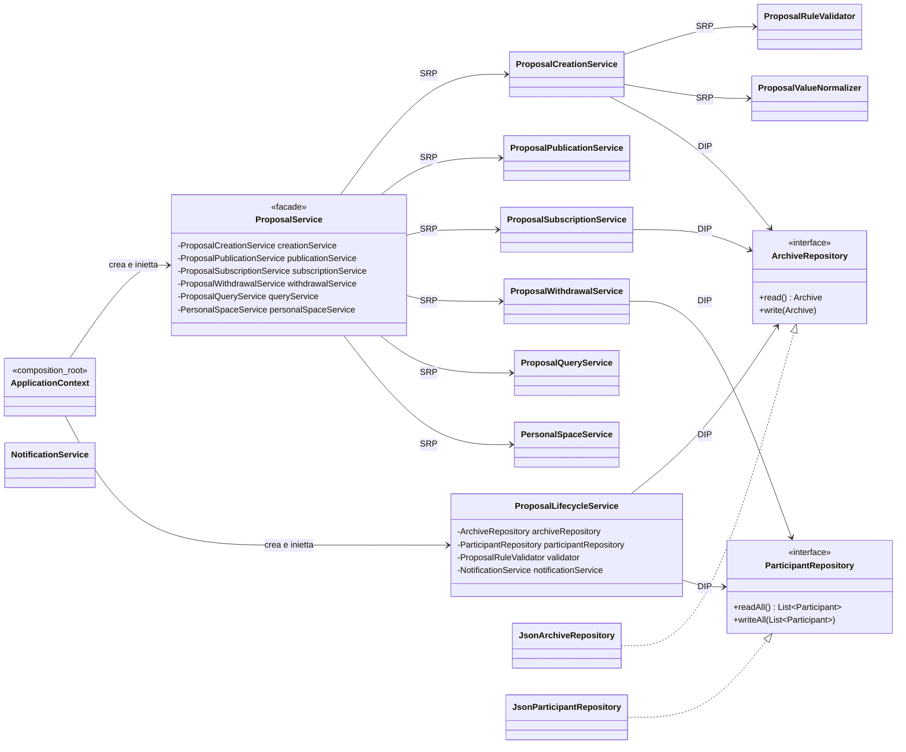

# Valutazione del punto 4: applicazione di principi SOLID

## Perimetro

Questa valutazione riguarda il punto 4 della traccia `TestoProgetto2023-24.pdf`: "Applicazione di al piu' due principi SOLID sulle classi del progetto".

La verifica e' stata svolta sul codice attualmente presente nella repository, tenendo conto della consegna funzionale `Elaborato2025_26_def.pdf`, che descrive una applicazione stand-alone Java per:

- configurare categorie e campi delle iniziative;
- creare, validare, pubblicare, ritirare e archiviare proposte;
- consentire ai fruitori di visualizzare la bacheca, iscriversi, disiscriversi e gestire notifiche;
- salvare in modo persistente configurazioni, utenti, categorie e archivio proposte;
- importare dati del back-end in modalita' batch JSON.

Il vincolo "al piu' due" viene interpretato in modo selettivo: non si tenta di dimostrare l'applicazione di tutti i principi SOLID, ma si individuano i due principi piu' effettivamente riconoscibili e presentabili nel progetto.

## Sintesi valutativa

I principi SOLID applicati in modo sostanziale sono:

1. Single Responsibility Principle (SRP).
2. Dependency Inversion Principle (DIP).

SRP e' riconoscibile nella separazione delle responsabilita' fra modello, servizi applicativi, validatori, normalizzatori, notifiche, repository e vista CLI. Nel sottosistema delle proposte, la responsabilita' prima concentrata in `ProposalService` e' ora distribuita in una Facade e in servizi interni dedicati.

DIP e' riconoscibile soprattutto nella persistenza: i servizi di alto livello dipendono da interfacce repository (`ArchiveRepository`, `ConfigRepository`, `CategoryRepository`, `ConfiguratorRepository`, `ParticipantRepository`) e non direttamente dalle classi JSON concrete. Le implementazioni JSON sono collegate nella composition root `ApplicationContext`.

La valutazione non considera come principi principali:

- OCP, perche' alcune varianti sono ancora gestite con `switch` su enum, quindi l'aggiunta di un nuovo `DataType` richiederebbe modifiche in piu' classi;
- LSP, perche' non ci sono gerarchie di ereditarieta' significative su cui valutare sostituibilita' fra superclassi e sottoclassi;
- ISP, perche' le interfacce repository sono piccole e coese, ma questa evidenza e' soprattutto di supporto a DIP e non abbastanza centrale da sceglierla come secondo principio al posto di DIP.

## Mappa architetturale dei principi scelti



La stessa struttura evidenzia entrambi i principi:

- SRP: `ProposalService` e' una Facade e non contiene piu' direttamente creazione, pubblicazione, iscrizioni, ritiro, query e spazio personale.
- DIP: i servizi applicativi non conoscono direttamente `JsonArchiveRepository` o `JsonParticipantRepository`, ma usano le interfacce.

## 1. Single Responsibility Principle

### Il principio e' stato applicato?

Si', SRP e' stato applicato in modo sostanziale.

La responsabilita' viene distribuita per area di cambiamento:

- `model`: stato e comportamento di dominio;
- `service`: casi d'uso e regole applicative;
- `persistence`: lettura e scrittura dello stato persistente;
- `ui` e `console`: input, output, menu e formattazione CLI;
- `factory`: costruzione di messaggi di notifica.

Questa separazione riduce il numero di ragioni per cui una singola classe deve cambiare. Ad esempio, cambiare il formato dei valori inseriti dall'utente riguarda `ProposalValueNormalizer`, mentre cambiare i vincoli temporali o numerici delle proposte riguarda `ProposalRuleValidator`.

### Dove e' applicato

#### `ProposalService`, `ProposalCreationService`, `ProposalRuleValidator` e `ProposalValueNormalizer`

`ProposalService` e' ora una Facade. Mantiene stabile l'API usata da controller e import batch, ma delega il lavoro a servizi piu' piccoli:

```java
// src/it/unibs/ingesw/service/proposal/ProposalService.java
private final ProposalCreationService creationService;
private final ProposalPublicationService publicationService;
private final ProposalSubscriptionService subscriptionService;
private final ProposalWithdrawalService withdrawalService;
private final ProposalQueryService queryService;
private final PersonalSpaceService personalSpaceService;

public Proposal createProposal(int categoryIndex, Map<String, String> rawValues) {
    return creationService.createProposal(categoryIndex, rawValues);
}
```

La responsabilita' di creazione e validazione iniziale e' concentrata in `ProposalCreationService`:

```java
// src/it/unibs/ingesw/service/proposal/ProposalCreationService.java
private Proposal createProposal(Category category, Map<String, String> rawValues) {
    List<Field> fields = configurationService.getSharedFieldsForCategory(category);
    Map<String, String> normalized = normalizer.normalizeAndValidateValues(fields, rawValues);
    // ...

    if (validator.checkDomainRules(normalized) && proposal.markAsValid()) {
        archive.saveProposal(proposal);
        archiveRepository.write(archive);
    }
    return proposal;
}
```

`ProposalValueNormalizer` ha una responsabilita' piu' specifica: trasformare e validare strutturalmente i valori grezzi ricevuti da UI o import batch.

```java
// src/it/unibs/ingesw/service/proposal/ProposalValueNormalizer.java
public Map<String, String> normalizeAndValidateValues(List<Field> fields, Map<String, String> rawValues) {
    Map<String, String> normalized = new LinkedHashMap<>();
    for (Field field : fields) {
        String fieldName = field.getName();
        String value = rawValues.get(fieldName);
        // ...

        String canonical = normalizeValue(value, field.getDataType());
        if (canonical == null) {
            return null;
        }
        normalized.put(fieldName, canonical);
    }
    return normalized;
}
```

`ProposalRuleValidator` ha invece la responsabilita' di valutare i vincoli di dominio sulle proposte gia' normalizzate:

```java
// src/it/unibs/ingesw/service/proposal/ProposalRuleValidator.java
public boolean checkDomainRules(Map<String, String> values) {
    LocalDate deadline = parseIsoDate(values.get(DEADLINE_FIELD_NAME));
    LocalDate startDate = parseIsoDate(values.get(START_DATE_FIELD_NAME));
    LocalDate endDate = parseIsoDate(values.get(END_DATE_FIELD_NAME));
    Integer participants = parseInteger(values.get(PARTICIPANTS_FIELD_NAME));
    Double fee = parseDouble(values.get(FEE_FIELD_NAME));

    if (deadline == null || !deadline.isAfter(LocalDate.now())) {
        return false;
    }
    if (startDate == null || startDate.isBefore(deadline.plusDays(2))) {
        return false;
    }
    // ...
    return fee != null && fee >= 0.0f;
}
```

Questa e' una buona applicazione di SRP: la Facade espone i casi d'uso, il servizio di creazione coordina la creazione, il normalizzatore converte input, il validatore controlla regole di dominio.

#### `ProposalLifecycleService`

Il passaggio automatico degli stati non e' mischiato con la creazione manuale o con l'interazione utente. E' concentrato in `ProposalLifecycleService`.

```java
// src/it/unibs/ingesw/service/proposal/ProposalLifecycleService.java
public void refreshProposalLifecycle() {
    boolean archiveChanged = false;
    boolean participantsChanged = false;

    for (Proposal proposal : archive.getProposals()) {
        if (proposal == null) {
            continue;
        }

        if (proposal.getCurrentStatus() == ProposalStatus.OPEN && validator.isDeadlineExpired(proposal)) {
            // transizioni automatiche e notifiche correlate
        }
    }

    if (archiveChanged) {
        archiveRepository.write(archive);
    }
    if (participantsChanged) {
        participantRepository.writeAll(notificationService.getParticipants());
    }
}
```

Questo rende piu' chiaro dove cambiare le regole di avanzamento automatico: scadenza iscrizioni, conferma, annullamento e chiusura non sono distribuite nei controller.

#### `NotificationService` e `NotificationFactory`

Le notifiche sono separate in due responsabilita':

- `NotificationFactory` costruisce il testo dei messaggi;
- `NotificationService` recapita i messaggi ai fruitori iscritti.

```java
// src/it/unibs/ingesw/service/proposal/NotificationService.java
public boolean notifyProposalConfirmed(Proposal proposal) {
    return notifySubscribers(proposal, NotificationFactory.buildProposalConfirmedNotification(proposal));
}

public boolean notifyProposalCanceled(Proposal proposal) {
    return notifySubscribers(proposal, NotificationFactory.buildProposalCanceledNotification(proposal));
}
```

Il cambiamento del testo di una notifica non obbliga a cambiare la logica di ricerca dei destinatari; il cambiamento del modo in cui si individuano i destinatari non obbliga a cambiare la formattazione del messaggio.

#### Repository e supporto JSON

Le classi repository concrete (`JsonArchiveRepository`, `JsonCategoryRepository`, `JsonConfigRepository`, `JsonConfiguratorRepository`, `JsonParticipantRepository`) hanno una responsabilita' stretta: caricare e salvare uno specifico aggregato.

La classe astratta `JsonRepositorySupport` concentra invece i dettagli tecnici comuni: directory dati, istanza Gson, lettura e scrittura JSON. Questo evita che ogni repository ripeta la stessa logica di I/O.

### Limiti rispetto a SRP

SRP e' applicato, ma non in modo perfetto.

`ConfiguratorInteraction` concentra molti elementi della vista CLI: testi, menu, prompt, parsing preliminare di input, tabelle e template dei campi base. In particolare, i campi base definiti dalla consegna sono dentro la vista:

```java
// src/it/unibs/ingesw/ui/ConfiguratorInteraction.java
private static final List<BaseFieldTemplate> BASE_FIELDS = List.of(
        new BaseFieldTemplate(BASE_FIELD_TITLE_NAME, BASE_FIELD_TITLE_DESCRIPTION),
        new BaseFieldTemplate(BASE_FIELD_PARTICIPANTS_NAME, BASE_FIELD_PARTICIPANTS_DESCRIPTION),
        new BaseFieldTemplate(BASE_FIELD_DEADLINE_NAME, BASE_FIELD_DEADLINE_DESCRIPTION),
        // ...
);
```

Questo e' accettabile per una CLI didattica, ma dal punto di vista SRP i campi base sono piu' vicini a configurazione/regole applicative che a pura presentazione.

## 2. Dependency Inversion Principle

### Il principio e' stato applicato?

Si', DIP e' stato applicato in modo sostanziale nel rapporto fra servizi applicativi e persistenza.

I servizi di alto livello non dipendono direttamente dalle classi JSON concrete. Dipendono invece da interfacce repository. Le classi concrete JSON sono nominate solo nella composition root (`ApplicationContext`) e nelle implementazioni del package `persistence`.

### Dove e' applicato

#### Interfacce repository

Esempio:

```java
// src/it/unibs/ingesw/persistence/ArchiveRepository.java
public interface ArchiveRepository {
    Archive read();
    void write(Archive archive);
}
```

L'implementazione JSON dipende dall'astrazione, non il contrario:

```java
// src/it/unibs/ingesw/persistence/JsonArchiveRepository.java
public class JsonArchiveRepository extends JsonRepositorySupport implements ArchiveRepository {
    private static final String PROPOSALS_FILE = "proposals.json";

    @Override
    public Archive read() {
        Archive archive = readJson(resolve(PROPOSALS_FILE), Archive.class, new Archive());
        return archive == null ? new Archive() : archive;
    }

    @Override
    public void write(Archive archive) {
        writeJson(resolve(PROPOSALS_FILE), archive);
    }
}
```

Lo stesso schema e' presente per:

- `ConfigRepository` / `JsonConfigRepository`;
- `CategoryRepository` / `JsonCategoryRepository`;
- `ConfiguratorRepository` / `JsonConfiguratorRepository`;
- `ParticipantRepository` / `JsonParticipantRepository`.

#### Servizi che dipendono dalle astrazioni

Il package `service.proposal` usa `ArchiveRepository` e `ParticipantRepository`, non `JsonArchiveRepository` o `JsonParticipantRepository`:

```java
// src/it/unibs/ingesw/service/proposal/ProposalCreationService.java
private final ArchiveRepository archiveRepository;

// src/it/unibs/ingesw/service/proposal/ProposalWithdrawalService.java
private final ArchiveRepository archiveRepository;
private final ParticipantRepository participantRepository;
```

La Facade riceve comunque le astrazioni dal contesto applicativo e le passa ai servizi focalizzati:

```java
// src/it/unibs/ingesw/service/proposal/ProposalService.java
this.creationService = new ProposalCreationService(
        archive,
        archiveRepository,
        configurationService,
        normalizer,
        validator
);
this.withdrawalService = new ProposalWithdrawalService(
        archive,
        participants,
        archiveRepository,
        participantRepository,
        validator,
        notificationService
);
```

Anche `ProposalLifecycleService`, `AuthenticationService` e `ConfigurationService` seguono lo stesso schema:

- `ProposalLifecycleService` dipende da `ArchiveRepository` e `ParticipantRepository`;
- `AuthenticationService` dipende da `ConfiguratorRepository` e `ParticipantRepository`;
- `ConfigurationService` dipende da `ConfigRepository` e `CategoryRepository`.

Questo permette di sostituire il dettaglio tecnico della persistenza, ad esempio passando da JSON a database, con un impatto limitato: si creano nuove implementazioni delle interfacce e si modifica il punto di composizione, non la logica dei servizi.

#### `ApplicationContext` come composition root

`ApplicationContext` e' il punto in cui le implementazioni concrete vengono scelte e iniettate.

```java
// src/it/unibs/ingesw/application/ApplicationContext.java
public ApplicationContext() {
    this(
            new JsonConfigRepository(),
            new JsonCategoryRepository(),
            new JsonConfiguratorRepository(),
            new JsonParticipantRepository(),
            new JsonArchiveRepository()
    );
}

this.proposalService = new ProposalService(
        archive,
        participants,
        archiveRepository,
        participantRepository,
        configurationService,
        notificationService,
        new ProposalValueNormalizer(),
        proposalRuleValidator
);
```

Questa e' una applicazione coerente di DIP: la scelta "usiamo JSON" e' confinata nella composizione dell'applicazione, mentre i servizi ricevono astrazioni.

### Limiti rispetto a DIP

DIP non e' applicato ovunque.

Il limite principale e' `BatchImportService`, che dipende direttamente da `JsonBatchImportReader`:

```java
// src/it/unibs/ingesw/service/BatchImportService.java
private final JsonBatchImportReader reader;

public BatchImportService(
        ConfigurationService configurationService,
        ProposalService proposalService,
        JsonBatchImportReader reader
) {
    this.configurationService = configurationService;
    this.proposalService = proposalService;
    this.reader = reader;
}
```

Qui un servizio applicativo conosce un dettaglio tecnico: il fatto che il batch import sia letto da JSON. Per rendere DIP piu' uniforme si potrebbe introdurre una astrazione, ad esempio:

```java
// Possibile refactoring futuro
public interface BatchImportReader {
    ReadResult<FieldsFile> readFieldsFile(String path);
    ReadResult<List<Category>> readCategoriesFile(String path);
    ReadResult<List<ProposalSeed>> readProposalsFile(String path);
}

public class JsonBatchImportReader implements BatchImportReader {
    // implementazione attuale
}
```

In quel caso `BatchImportService` dipenderebbe da `BatchImportReader`, e l'eventuale passaggio da JSON a CSV, database o API esterna non richiederebbe modifiche al servizio.

## Principi non scelti come applicazione principale

### Open-Closed Principle

OCP non e' il candidato piu' convincente per questa valutazione.

Alcune parti sono estensibili a livello di dati, ad esempio nuove categorie e nuovi campi possono essere aggiunti senza nuove classi. Tuttavia l'estensione dei tipi di dato non e' chiusa alla modifica: aggiungere un nuovo valore in `DataType` richiederebbe aggiornare piu' punti con `switch`, ad esempio:

- `ProposalValueNormalizer.normalizeValue(...)`;
- `FormatValues.formatByType(...)`;
- `ConfiguratorInteraction.readFieldValue(...)` e i relativi testi di input.

Quindi il progetto e' flessibile rispetto a categorie/campi configurabili, ma non mostra una applicazione generale e forte di OCP sulle classi.

### Liskov Substitution Principle

LSP non e' particolarmente valutabile: il progetto usa soprattutto classi concrete, enum e interfacce repository. Non ci sono gerarchie significative di superclassi e sottoclassi in cui verificare se una sottoclasse possa sostituire correttamente la superclasse.

### Interface Segregation Principle

ISP e' presente solo come effetto collaterale positivo delle interfacce repository: ogni repository espone pochi metodi coerenti con il proprio aggregato. Tuttavia non ci sono client diversi costretti o non costretti a usare porzioni di una grande interfaccia; quindi e' meglio non presentarlo come principio SOLID principale.

## Risposta diretta alle domande

### I principi SOLID sono stati applicati?

Si', nel limite richiesto dalla traccia sono stati applicati due principi SOLID in modo presentabile: SRP e DIP.

L'applicazione non e' perfetta, ma e' sostanziale. Non si tratta solo di nomi di package: il codice mostra responsabilita' separate e dipendenze verso astrazioni repository nei servizi di alto livello.

### Quali principi sono stati applicati?

I due principi da presentare sono:

1. Single Responsibility Principle.
2. Dependency Inversion Principle.

OCP, LSP e ISP non sono scelti come esempi principali perche' l'evidenza nel codice e' piu' debole o meno centrale.

### Dove sono stati applicati?

SRP e' applicato soprattutto in:

- `ProposalService`, che ora agisce da Facade del package `service.proposal`;
- `ProposalCreationService`, `ProposalPublicationService`, `ProposalSubscriptionService`, `ProposalWithdrawalService`, `ProposalQueryService` e `PersonalSpaceService`, che separano i casi d'uso prima concentrati in un unico servizio;
- `ProposalValueNormalizer`, responsabile della normalizzazione dei valori;
- `ProposalRuleValidator`, responsabile delle regole di validita' e lifecycle;
- `ProposalLifecycleService`, responsabile dei passaggi automatici di stato;
- `NotificationService` e `NotificationFactory`, che separano recapito e costruzione dei messaggi;
- `JsonRepositorySupport` e repository JSON concreti, che separano persistenza tecnica e aggregati salvati.

DIP e' applicato soprattutto in:

- `ArchiveRepository`, `ConfigRepository`, `CategoryRepository`, `ConfiguratorRepository`, `ParticipantRepository`;
- `JsonArchiveRepository`, `JsonConfigRepository`, `JsonCategoryRepository`, `JsonConfiguratorRepository`, `JsonParticipantRepository`;
- `AuthenticationService`, `ConfigurationService`, `ProposalService`, `ProposalLifecycleService` e i servizi focalizzati del package `service.proposal`;
- `ApplicationContext`, che crea le implementazioni concrete e le inietta nei servizi.

## Valutazione finale

Il punto 4 della traccia e' validabile.

La presentazione puo' sostenere con buona evidenza che il progetto applica SRP e DIP. SRP emerge dalla decomposizione delle responsabilita' nel package `service.proposal` e dagli altri collaboratori specializzati; DIP emerge dall'uso di interfacce repository e dalla centralizzazione della scelta delle implementazioni JSON in `ApplicationContext`.

Per una discussione onesta conviene citare anche i limiti residui: `ConfiguratorInteraction` e' ancora piuttosto ampia, e `BatchImportService` dipende direttamente da `JsonBatchImportReader`. Questi limiti non annullano l'applicazione dei due principi, ma indicano dove un ulteriore refactoring potrebbe renderla piu' rigorosa.
