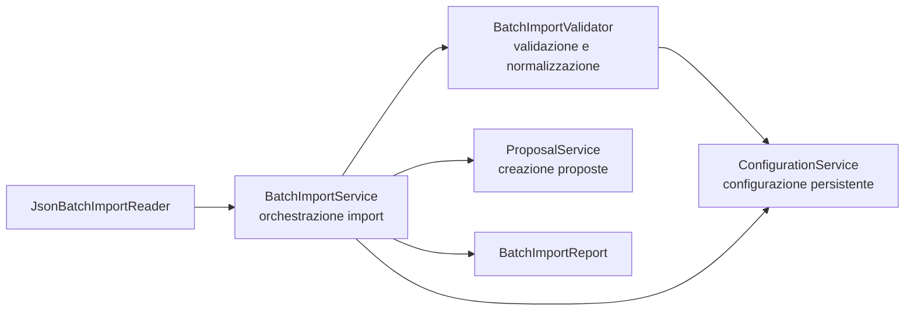

# Valutazione del punto 7: rifattorizzazione

## Perimetro

Questa valutazione riguarda il punto 7 della traccia `TestoProgetto2023-24.pdf`: "Rifattorizzazione di al piu' un metodo o classe del progetto, evidenziando quali pattern di Refactoring sono stati applicati".

La verifica e' stata svolta sul codice attualmente presente nella repository, tenendo conto della consegna funzionale `Elaborato2025_26_def.pdf`. La funzionalita' selezionata e' quella della versione 5: importazione batch degli ingressi del back-end, cioe' categorie, campi e nuove proposte da file, mantenendo operativa anche la modalita' interattiva.

Il materiale di riferimento sui pattern di refactoring e' costituito da `11-Refactoring.pdf` e `12-Refactoring-Addon.pdf`. In particolare, `11-Refactoring.pdf` presenta fra i pattern principali:

- `Extract Method`;
- `Move Method`;
- `Extract Class`;
- `Replace Type Code with Subclasses`;
- `Replace Conditional with Polymorphism`.

## Sintesi valutativa

La classe rifattorizzata e' `BatchImportService`.

Prima dell'intervento, questa classe gestiva contemporaneamente:

- lettura dei file JSON di importazione;
- costruzione del `BatchImportReport`;
- validazione di campi base, campi comuni e campi specifici;
- validazione delle categorie;
- canonicalizzazione dei nomi dei campi delle proposte;
- invocazione di `ConfigurationService` e `ProposalService` per applicare le modifiche.

Il refactoring applicato estrae la responsabilita' di validazione e normalizzazione in una nuova classe, `BatchImportValidator`, lasciando a `BatchImportService` il ruolo di orchestratore del caso d'uso. La modifica non cambia i requisiti funzionali: i file batch validi continuano a essere importati, mentre quelli malformati o incoerenti continuano a produrre report di scarto.

## Classe e requisito selezionati

### Classe selezionata

`src/it/unibs/ingesw/service/BatchImportService.java`

La classe era un buon candidato per il punto 7 perche' era lunga e conteneva due responsabilita' diverse:

- coordinare l'importazione batch;
- validare dettagli strutturali degli oggetti letti dai file.

### Funzionalita' selezionata

Importazione batch, requisito della versione 5:

- importare campi base e comuni;
- importare categorie con campi specifici;
- importare proposte;
- scartare solo le singole entita' non valide quando possibile;
- non modificare lo stato persistente se il file e' illeggibile o malformato.

## Codice sotto test

Il refactoring e' stato eseguito dopo avere messo il comportamento sotto test.

Erano gia' presenti test di flusso sulla funzionalita' batch:

```java
// test/it/unibs/ingesw/test/BatchImportServiceFlowTest.java
@Test
void importProposalsHandlesValidCreatedAndDiscardedEntriesIndependently() throws IOException {
    TestApplicationContext context = prepareContextWithSportCategory();
    Path batchFile = writeFile("proposals-batch.json", "... contenuto JSON ...");

    BatchImportReport report = context.getBatchImportService().importProposals(batchFile.toString());

    assertEquals(4, report.getTotalEntries());
    assertEquals(2, report.getImportedEntries());
    assertEquals(2, report.getDiscardedEntries());
}
```

Per guidare l'estrazione e' stato aggiunto un test specifico sul nuovo collaboratore:

```java
// test/it/unibs/ingesw/test/BatchImportValidatorTest.java
@Test
void validateProposalSeedMapsTrimmedFieldNamesToConfiguredNames() {
    TestApplicationContext context = prepareContextWithSportCategory();
    BatchImportValidator validator = new BatchImportValidator(context.getConfigurationService());

    Map<String, String> rawValues = new LinkedHashMap<>();
    rawValues.put(" titolo ", "Camminata");
    rawValues.put("numero di partecipanti", "20");
    rawValues.put("certificato medico", "true");

    BatchImportValidator.ValidatedProposalSeed validation = validator.validateProposalSeed(
            new JsonBatchImportReader.ProposalSeed(" sport ", rawValues)
    );

    assertTrue(validation.isValid());
    assertEquals("Sport", validation.category().getName());
    assertEquals("Camminata", validation.fieldValues().get("Titolo"));
    assertFalse(validation.fieldValues().containsKey(" titolo "));
}
```

Il primo run del nuovo test falliva in compilazione per assenza di `BatchImportValidator`. Questo era il fallimento atteso: il test descriveva l'API da ottenere con l'estrazione.

## Pattern di refactoring applicati

### 1. Extract Class

`Extract Class` e' il pattern principale applicato.

Situazione: `BatchImportService` lavorava per due scopi. Da un lato governava il flusso applicativo dell'importazione, dall'altro conteneva regole strutturali di validazione e normalizzazione.

Soluzione applicata: e' stata creata `BatchImportValidator`, che riceve `ConfigurationService` e centralizza le verifiche sui dati caricati:

```java
// src/it/unibs/ingesw/service/BatchImportValidator.java
public class BatchImportValidator {
    private final ConfigurationService configurationService;

    public BatchImportValidator(ConfigurationService configurationService) {
        this.configurationService = configurationService;
    }

    public ValidatedFields validateBaseFields(List<Field> rawBaseFields) {
        // valida campi base, obbligatorieta', duplicati e nomi gia' in uso
    }

    public ValidatedCategory validateCategory(Category rawCategory) {
        // valida nome categoria e campi specifici
    }

    public ValidatedProposalSeed validateProposalSeed(JsonBatchImportReader.ProposalSeed proposalSeed) {
        // valida categoria e canonicalizza i nomi dei campi della proposta
    }
}
```

Dopo l'estrazione, `BatchImportService` delega la validazione:

```java
// src/it/unibs/ingesw/service/BatchImportService.java
private void importProposal(JsonBatchImportReader.ProposalSeed proposalSeed, int index, BatchImportReport report) {
    BatchImportValidator.ValidatedProposalSeed validation = validator.validateProposalSeed(proposalSeed);
    if (!validation.isValid()) {
        report.addIssue(PROPOSAL_DISCARDED_TEMPLATE.formatted(index + 1, validation.errorMessage()));
        return;
    }

    Proposal proposal = proposalService.createProposal(validation.category().getName(), validation.fieldValues());
    // ...
}
```

La responsabilita' e' ora piu' netta:

- `BatchImportService`: importa, applica e produce report;
- `BatchImportValidator`: valida, normalizza e canonicalizza;
- `ConfigurationService`: applica modifiche persistenti alla configurazione;
- `ProposalService`: crea proposte rispettando le regole applicative gia' esistenti.

### 2. Move Method

`Move Method` e' stato usato come pattern strumentale all'`Extract Class`.

Alcune operazioni che erano metodi privati o blocchi interni di `BatchImportService` usavano soprattutto dati di configurazione e regole di validazione, non lo stato del report. Per questo sono state spostate nella nuova classe.

Esempio: la canonicalizzazione dei valori di proposta e' ora responsabilita' del validatore:

```java
// src/it/unibs/ingesw/service/BatchImportValidator.java
private ValidatedProposalSeed canonicalizeProposalValues(Category category, Map<String, String> rawValues) {
    if (rawValues == null) {
        return ValidatedProposalSeed.failure(PROPOSAL_FIELD_VALUES_REQUIRED_MESSAGE);
    }

    Map<String, String> expectedFieldNames = new LinkedHashMap<>();
    for (Field field : configurationService.getSharedFieldsForCategory(category)) {
        expectedFieldNames.put(canonicalize(field.getName()), field.getName());
    }

    Map<String, String> canonicalFieldValues = new LinkedHashMap<>();
    // associa i nomi forniti dal file ai nomi configurati nell'applicazione
}
```

`BatchImportService` non deve piu' sapere come si costruisce la mappa dei nomi canonici; deve solo ricevere un esito valido o un messaggio di errore.

## Mappa dopo il refactoring



## Effetti sul codice

Prima dell'intervento `BatchImportService` conteneva 455 righe. Dopo il refactoring:

- `BatchImportService` contiene 238 righe;
- `BatchImportValidator` contiene 333 righe;
- `BatchImportValidatorTest` contiene 104 righe di test mirati.

La riduzione di righe nella classe originaria non e' il fine principale, ma rende visibile la separazione: il servizio non contiene piu' l'intera grammatica di validazione dell'import batch.

## Pattern non applicati

Non sono stati scelti:

- `Replace Conditional with Polymorphism`, perche' i rami condizionali residui non rappresentano varianti stabili di sottotipi, ma esiti di validazione e casi di errore;
- `Replace Type Code with Subclasses`, perche' `FieldType`, `DataType` e `ProposalStatus` sono enum di dominio gia' chiari e non sono l'odore principale in questa classe;
- `Replace Method with Method Object`, perche' il problema non era un singolo metodo con troppe variabili locali, ma una classe con responsabilita' miste.

## Valutazione finale

Il punto 7 risulta preparato in modo sostanziale.

La rifattorizzazione riguarda una sola classe del progetto, `BatchImportService`, e una sola funzionalita' ben identificata, l'importazione batch della versione 5. I pattern applicati sono `Extract Class` come intervento principale e `Move Method` come supporto all'estrazione.

Il comportamento e' protetto da test di flusso gia' esistenti e da un nuovo test mirato su `BatchImportValidator`. La nuova struttura migliora coesione e leggibilita': quando si legge `BatchImportService`, si vede il caso d'uso; quando si legge `BatchImportValidator`, si vedono le regole di accettazione degli input batch.
