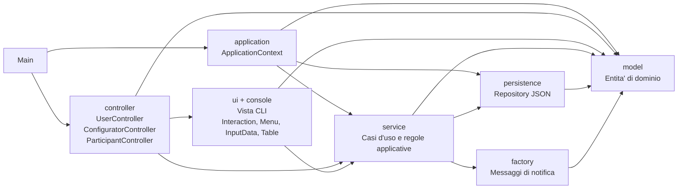

# Valutazione del punto 2: separazione modello-vista

## Perimetro

Questa valutazione riguarda il punto 2 della traccia `TestoProgetto2023-24.pdf`: "Applicazione del principio di separazione modello-vista al progetto".

La verifica e' stata svolta sul codice attualmente presente nella repository e tenendo conto della consegna funzionale `Elaborato2025_26_def.pdf`, che descrive un'applicazione stand-alone Java con:

- un back-end per il configuratore;
- un front-end per il fruitore;
- persistenza dei dati applicativi;
- interazione utente non necessariamente grafica.

Il principio viene quindi valutato nel contesto concreto di una applicazione CLI: la "vista" coincide con gli oggetti che leggono da terminale, stampano su terminale e costruiscono menu/tabelle testuali.

## Sintesi valutativa

Il principio di separazione modello-vista e' stato applicato in modo sostanziale.

Il modello di dominio non contiene codice di input/output, non conosce le classi di interazione con l'utente e non dipende dai controller. Le classi di vista sono concentrate nei package `ui` e `console`, mentre i controller coordinano il flusso applicativo chiamando da un lato la vista e dall'altro i servizi.

La soluzione non e' un MVC "puro" in senso stretto, perche':

- le viste CLI ricevono e leggono direttamente oggetti del modello, come `Proposal`, `Field` e `Notification`;

Questi elementi non annullano la separazione modello-vista, perche' la dipendenza rimane principalmente in una sola direzione: la vista conosce il modello, ma il modello non conosce la vista.

## Mappa architetturale



La separazione principale e' questa:

- `model`: contiene stato e comportamenti di dominio.
- `ui` e `console`: contengono la vista testuale, cioe' prompt, menu, stampe, tabelle e formattazione.
- `controller`: orchestra i casi d'uso e collega vista e servizi.
- `service`: contiene regole applicative, validazioni, lifecycle e coordinamento con la persistenza.
- `persistence`: isola lettura e scrittura JSON.
- `application`: compone l'oggetto applicativo e collega implementazioni concrete.

## Dove il principio e' applicato

### 1. Il modello non dipende dalla vista

Le classi del package `model` importano solo classi Java standard e altre classi del modello. Non importano `ui`, `console`, `controller`, `service` o `persistence`.

Esempi:

```java
// src/it/unibs/ingesw/model/Proposal.java
package it.unibs.ingesw.model;

import java.time.LocalDateTime;
import java.util.ArrayList;
import java.util.Collections;
import java.util.LinkedHashMap;
import java.util.List;
import java.util.Map;
```

`Proposal` gestisce lo stato di una proposta, gli iscritti e le transizioni ammesse, ma non stampa messaggi e non legge input:

```java
// src/it/unibs/ingesw/model/Proposal.java
public boolean markAsOpen() {
    if (currentStatus != ProposalStatus.VALID) {
        return false;
    }
    appendState(ProposalStatus.OPEN);
    return true;
}
```

Analogamente, `Archive` filtra e raggruppa proposte senza conoscere il modo in cui saranno mostrate:

```java
// src/it/unibs/ingesw/model/Archive.java
public Map<String, List<Proposal>> getOpenByCategory() {
    Map<String, List<Proposal>> grouped = new LinkedHashMap<>();
    for (Proposal proposal : getByStatus(ProposalStatus.OPEN)) {
        String categoryName = proposal.getCategoryName();
        if (categoryName == null || categoryName.isBlank()) {
            categoryName = UNTITLED_CATEGORY;
        }
        grouped.computeIfAbsent(categoryName, _ -> new ArrayList<>()).add(proposal);
    }
    // ...
}
```

Questo e' il punto piu' forte della separazione: il modello resta indipendente dal canale di interazione. Una futura GUI potrebbe riusare `model` e buona parte di `service` senza portarsi dietro `System.out`, `Scanner`, menu testuali o tabelle CLI.

### 2. La vista CLI e' concentrata nei package `ui` e `console`

Le classi di interazione sono responsabili di:

- leggere input;
- costruire menu;
- stampare messaggi;
- formattare dati per l'utente;
- mostrare tabelle e bacheche.

Esempio da `ConfiguratorInteraction`:

```java
// src/it/unibs/ingesw/ui/ConfiguratorInteraction.java
public String readLoginUsername() {
    return InputData.readNonEmptyString(LOGIN_USERNAME_PROMPT, true).trim();
}

public int chooseMainMenu(boolean baseFieldsSet) {
    List<String> entries = new ArrayList<>();
    entries.add(baseFieldsSet ? MAIN_MENU_SHOW_BASE : MAIN_MENU_SET_BASE);
    // ...
    return new Menu(MAIN_MENU_TITLE, entries, true, Alignment.CENTER, true).choose();
}
```

Esempio da `UserInteraction`, che mostra la bacheca:

```java
// src/it/unibs/ingesw/ui/UserInteraction.java
public void showBoard(Map<String, List<Proposal>> board) {
    if (board == null || board.isEmpty()) {
        printCancelled(NO_OPEN_PROPOSALS_MESSAGE);
        return;
    }

    for (Map.Entry<String, List<Proposal>> entry : board.entrySet()) {
        printInfo(CATEGORY_TITLE_TEMPLATE.formatted(entry.getKey()));
        for (Proposal proposal : entry.getValue()) {
            // stampa della proposta
        }
    }
}
```

Queste classi costituiscono la vista del progetto. Il fatto che importino classi del modello e' normale in un'architettura a strati: la vista deve leggere dati da visualizzare. L'aspetto rilevante e' che la dipendenza inversa non esiste.

### 3. I controller mediano fra vista e modello applicativo

I controller non dovrebbero contenere direttamente le regole di dominio profonde. Nel progetto svolgono soprattutto il ruolo di coordinatori:

- chiedono dati alla vista;
- invocano servizi applicativi;
- decidono quale messaggio mostrare in base all'esito.

Esempio dal login configuratore:

```java
// src/it/unibs/ingesw/controller/ConfiguratorController.java
private Configurator login() {
    while (true) {
        String username = interaction.readLoginUsername();      // vista
        String password = interaction.readLoginPassword();      // vista
        Configurator configurator =
                authenticationService.authenticateConfigurator(username, password); // servizio
        if (configurator != null) {
            return configurator;
        }
        interaction.printInvalidCredentials();                  // vista
    }
}
```

Esempio dalla creazione proposta:

```java
// src/it/unibs/ingesw/controller/ConfiguratorController.java
for (Field field : fields) {
    if (!field.isMandatory() && !interaction.askFillOptionalField(field.getName())) {
        continue;
    }
    rawValues.put(field.getName(), interaction.readFieldValue(field));
}

Proposal proposal = proposalService.createProposal(categoryIndex, rawValues);
```

Questo mostra una buona separazione: il controller non stampa direttamente, non valida da solo tutte le regole di dominio e non persiste direttamente i dati.

### 4. Le regole applicative sono spostate nei servizi

Le regole di autenticazione, configurazione, proposta, lifecycle e notifiche sono nei servizi. Questi servizi non importano classi di vista.

Esempio di regole di proposta:

```java
// src/it/unibs/ingesw/service/ProposalRuleValidator.java
public boolean checkDomainRules(Map<String, String> values) {
    LocalDate deadline = parseIsoDate(values.get(DEADLINE_FIELD_NAME));
    LocalDate startDate = parseIsoDate(values.get(START_DATE_FIELD_NAME));
    LocalDate endDate = parseIsoDate(values.get(END_DATE_FIELD_NAME));
    Integer participants = parseInteger(values.get(PARTICIPANTS_FIELD_NAME));
    Double fee = parseDouble(values.get(FEE_FIELD_NAME));

    if (deadline == null || !deadline.isAfter(LocalDate.now())) {
        return false;
    }
    // ...
}
```

Esempio di servizio applicativo:

```java
// src/it/unibs/ingesw/service/ProposalService.java
public boolean subscribeParticipantToProposal(Participant participant, int proposalId) {
    if (participant == null) {
        return false;
    }

    Proposal proposal = archive.findById(proposalId);
    if (proposal == null || proposal.getCurrentStatus() != ProposalStatus.OPEN) {
        return false;
    }
    // ...
}
```

La vista non decide se una proposta e' valida, aperta, ritirabile o sottoscrivibile: queste decisioni sono nei servizi e nel modello.

### 5. La persistenza e' separata sia dalla vista sia dai controller

Il package `persistence` usa repository e implementazioni JSON. I controller non leggono e scrivono file direttamente: passano dai servizi, che a loro volta usano repository.

```java
// src/it/unibs/ingesw/persistence/ArchiveRepository.java
public interface ArchiveRepository {
    Archive read();
    void write(Archive archive);
}
```

```java
// src/it/unibs/ingesw/persistence/JsonArchiveRepository.java
public class JsonArchiveRepository extends JsonRepositorySupport implements ArchiveRepository {
    private static final String PROPOSALS_FILE = "proposals.json";

    @Override
    public Archive read() {
        Archive archive = readJson(resolve(PROPOSALS_FILE), Archive.class, new Archive());
        return archive == null ? new Archive() : archive;
    }
}
```

Questa separazione aiuta indirettamente anche il principio modello-vista: la vista non contiene dettagli di storage, e il modello non contiene dettagli JSON.

### 6. `ApplicationContext` agisce da composition root

`ApplicationContext` crea repository e servizi una sola volta, caricando lo stato condiviso e iniettandolo ai servizi.

```java
// src/it/unibs/ingesw/application/ApplicationContext.java
SystemConfig config = configRepository.read();
List<Category> categories = categoryRepository.readAll();
List<Configurator> configurators = configuratorRepository.readAll();
List<Participant> participants = participantRepository.readAll();
Archive archive = archiveRepository.read();

this.authenticationService = new AuthenticationService(
        configurators,
        participants,
        configuratorRepository,
        participantRepository
);
```

Questo limita la conoscenza delle implementazioni concrete e rende piu' chiaro dove vengono collegati modello, servizi e persistenza.

## Accoppiamento residuo

### La vista conosce direttamente gli oggetti di dominio

Le classi `ui` importano `Proposal`, `Field`, `Notification` e `StateLog`. Per una CLI didattica e' accettabile, ma una separazione ancora piu' netta introdurrebbe DTO o view model, ad esempio `ProposalView`, `FieldView`, `NotificationView`.

Questo ridurrebbe il rischio che una modifica interna del modello obblighi a modificare la vista.

## Risposta diretta alle due domande

### Il principio e' stato applicato?

Si', il principio e' stato applicato.

La prova principale e' l'assenza di dipendenze dal modello verso la vista: le classi `model` non leggono input, non stampano output e non importano classi `ui` o `console`. Inoltre, le regole applicative sono per lo piu' nei servizi, non nei metodi di stampa o input.

La separazione non e' assoluta, perche' la vista usa direttamente oggetti del modello. Tuttavia la direzione delle dipendenze e' coerente con una architettura stratificata e sufficiente per sostenere che il refactoring modello-vista e' stato realizzato.

### Dove e' stato applicato?

Il principio e' applicato soprattutto in questi punti:

1. Nel package `model`, che contiene entita' e logica di stato senza I/O.
2. Nei package `ui` e `console`, che concentrano prompt, menu, stampe, tabelle e formattazione.
3. Nei controller, che separano il flusso interattivo dalle regole applicative.
4. Nei servizi, che contengono casi d'uso, validazione, lifecycle e notifiche senza dipendere dalla vista.
5. Nei repository, che separano la persistenza JSON sia dalla vista sia dal modello.
6. In `ApplicationContext`, che centralizza il collegamento fra componenti.

## Valutazione finale

La separazione modello-vista e' valida e presentabile per il punto 2 della traccia.

La motivazione piu' forte e' che il modello e i servizi non sono contaminati da codice di interfaccia utente. L'applicazione puo' essere descritta come una architettura a strati con vista CLI, controller di coordinamento, servizi applicativi, modello di dominio e persistenza JSON.
