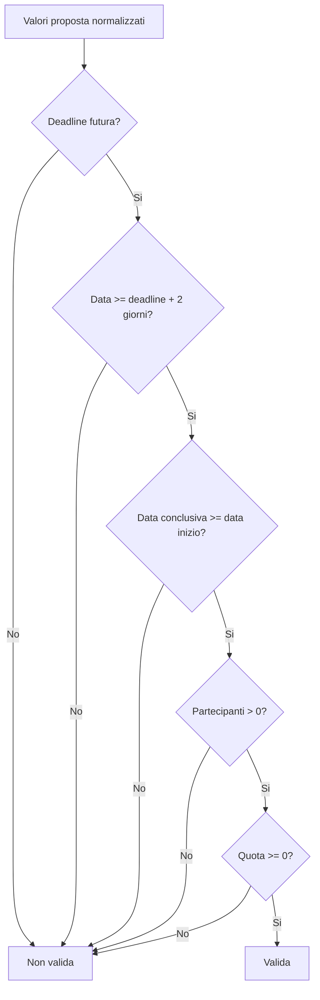

# Valutazione del punto 6: testing

## Perimetro

Questa valutazione riguarda il punto 6 della traccia `TestoProgetto2023-24.pdf`: "Testing di al piu' un metodo o classe, e di al piu' una funzionalita' o requisito, evidenziando quali tipologie di testing sono state applicate e i casi di test derivati".

La verifica e' stata svolta sul codice attualmente presente nella repository e tenendo conto della consegna funzionale `Elaborato2025_26_def.pdf`, in particolare del requisito della versione 2 secondo cui una proposta diventa valida solo se:

- il campo `Termine ultimo di iscrizione` e' successivo alla data corrente;
- il campo `Data` e' successivo di almeno due giorni rispetto al termine ultimo di iscrizione;
- sono rispettati i vincoli applicativi necessari alla creazione di una proposta valida.

Il test introdotto e' contenuto in:

```text
test/it/unibs/ingesw/test/ProposalRuleValidatorBlackBoxTest.java
```

## Sintesi valutativa

E' stato scelto un test black-box, perche' i casi di test sono derivati dal requisito funzionale e dall'interfaccia pubblica del metodo, non dalla struttura interna degli `if` presenti nel codice.

L'unita' testata e':

```text
src/it/unibs/ingesw/service/proposal/ProposalRuleValidator.java
```

Il metodo testato e':

```java
public boolean checkDomainRules(Map<String, String> values)
```

La funzionalita' o requisito testato e' l'assegnazione automatica della validita' di una proposta, limitatamente ai vincoli di dominio controllati da `ProposalRuleValidator`.

## Collegamento con il requisito

Nel flusso applicativo, `ProposalCreationService` crea la proposta, la salva nello stato iniziale e poi invoca il validatore. Solo se `checkDomainRules(...)` restituisce `true`, la proposta viene marcata come valida:

```java
// src/it/unibs/ingesw/service/proposal/ProposalCreationService.java
if (validator.checkDomainRules(normalized) && proposal.markAsValid()) {
    archive.saveProposal(proposal);
    archiveRepository.write(archive);
}
```

Il metodo scelto e' quindi piccolo, isolabile e direttamente collegato al requisito "proposta valida" della versione 2. Questa scelta evita di testare tutta la creazione proposta, che coinvolgerebbe anche configurazione, repository JSON e normalizzazione dell'input.

## Tipo di testing applicato

### Black-box funzionale

Il testing applicato e' black-box funzionale:

- il punto di partenza e' la specifica del requisito;
- l'input e' la mappa dei valori normalizzati della proposta;
- l'output osservabile e' un booleano: `true` se la proposta rispetta le regole, `false` altrimenti;
- i test non dipendono dall'ordine degli `if` nel metodo.

Le tecniche usate sono:

- partizionamento in classi di equivalenza;
- analisi dei valori limite.
- linee guida di Whittaker per input anomali e stress degli ingressi.

Non e' stato scelto un test white-box perche' l'obiettivo del punto 6, in questo caso, e' mostrare che il requisito funzionale viene soddisfatto. La copertura di alcuni rami del metodo e' un effetto utile, ma non e' il criterio con cui sono stati derivati i casi.

## Oggetto del test

`ProposalRuleValidator.checkDomainRules(...)` riceve valori gia' normalizzati nel formato usato dal dominio e dalla persistenza:

```java
// src/it/unibs/ingesw/service/proposal/ProposalRuleValidator.java
public boolean checkDomainRules(Map<String, String> values) {
    if (values == null) {
        return false;
    }
    LocalDate deadline = parseIsoDate(values.get(DEADLINE_FIELD_NAME));
    LocalDate startDate = parseIsoDate(values.get(START_DATE_FIELD_NAME));
    LocalDate endDate = parseIsoDate(values.get(END_DATE_FIELD_NAME));
    Integer participants = parseInteger(values.get(PARTICIPANTS_FIELD_NAME));
    Double fee = parseDouble(values.get(FEE_FIELD_NAME));

    if (deadline == null || !deadline.isAfter(LocalDate.now())) {
        return false;
    }
    if (startDate == null || startDate.isBefore(deadline.plusDays(2))) {
        return false;
    }
    if (endDate == null || endDate.isBefore(startDate)) {
        return false;
    }
    if (participants == null || participants <= 0) {
        return false;
    }
    return fee != null && fee >= 0.0f;
}
```

La scelta di passare date ISO nel test e' intenzionale: il metodo non rappresenta l'interfaccia utente, ma il confine interno dopo la normalizzazione. Il formato `dd/MM/yyyy` viene gestito prima, da `ProposalValueNormalizer`.

## Casi di test derivati

Come negli esempi delle slide, la derivazione e' stata separata in due tabelle: prima le classi di equivalenza, poi i valori limite. Ogni classe o valore selezionato corrisponde a un metodo JUnit distinto.

### Equivalence partitioning

| Condizione di input | Invalid | Valid | Invalid |
| --- | --- | --- | --- |
| `Termine ultimo di iscrizione` | data non futura: `oggi - 1` -> `rejectsDeadlineNotAfterTodayEquivalenceClass` | data futura: `oggi + 10` -> `acceptsFutureDeadlineEquivalenceClass` | formato non canonico: `10/12/2030` -> `rejectsNonCanonicalDateEquivalenceClass` |
| `Data` rispetto al termine iscrizione | meno di 2 giorni dopo il termine: `deadline + 1` -> `rejectsStartDateBeforeMinimumEquivalenceClass` | almeno 2 giorni dopo il termine: `deadline + 3` -> `acceptsStartDateAfterMinimumEquivalenceClass` | formato non canonico: `13/12/2030` -> `rejectsNonCanonicalStartDateEquivalenceClass` |
| `Data conclusiva` rispetto alla data inizio | precedente alla data inizio: `start - 1` -> `rejectsEndDateBeforeStartEquivalenceClass` | uguale o successiva alla data inizio: `start + 1` -> `acceptsEndDateAfterStartEquivalenceClass` | formato non canonico: `13/12/2030` -> `rejectsNonCanonicalEndDateEquivalenceClass` |
| `Numero di partecipanti` | non positivo: `-5` -> `rejectsNonPositiveParticipantsEquivalenceClass` | positivo: `20` -> `acceptsPositiveParticipantsEquivalenceClass` | non numerico: `dieci` -> `rejectsNonNumericParticipantsEquivalenceClass` |
| `Quota individuale` | negativa: `-12.5` -> `rejectsNegativeFeeEquivalenceClass` | zero o positiva: `12.5` -> `acceptsPositiveFeeEquivalenceClass` | non numerica: `gratis` -> `rejectsNonNumericFeeEquivalenceClass` |

### Boundary value analysis

| Condizione di input | Invalid `min - 1` | Valid `min` | Valid `min + 1` o valore interno |
| --- | --- | --- | --- |
| `Termine ultimo di iscrizione > oggi` | `oggi` -> `rejectsDeadlineBoundaryToday` | `oggi + 1` -> `acceptsDeadlineBoundaryTomorrow` | `oggi + 10` -> `acceptsFutureDeadlineEquivalenceClass` |
| `Data >= deadline + 2 giorni` | `deadline + 1` -> `rejectsStartDateBoundaryDeadlinePlusOneDay` | `deadline + 2` -> `acceptsStartDateBoundaryDeadlinePlusTwoDays` | `deadline + 3` -> `acceptsStartDateAfterMinimumEquivalenceClass` |
| `Data conclusiva >= Data` | `start - 1` -> `rejectsEndDateBoundaryDayBeforeStartDate` | `start` -> `acceptsEndDateBoundarySameAsStartDate` | `start + 1` -> `acceptsEndDateAfterStartEquivalenceClass` |
| `Numero di partecipanti >= 1` | `0` -> `rejectsParticipantsBoundaryZero` | `1` -> `acceptsParticipantsBoundaryOne` | `20` -> `acceptsPositiveParticipantsEquivalenceClass` |
| `Quota individuale >= 0` | `-0.01` -> `rejectsFeeBoundaryBelowZero` | `0` -> `acceptsFeeBoundaryZero` | `12.5` -> `acceptsPositiveFeeEquivalenceClass` |

La copertura black-box ottenuta resta selettiva, ma ora ogni classe e ogni valore limite scelto e' eseguito da un test dedicato. Le combinazioni fra piu' valori invalidi non vengono moltiplicate, perche' avrebbero prodotto casi ridondanti rispetto al requisito selezionato.

### Linee guida di Whittaker

Le slide di testing indicano anche alcune linee guida di Whittaker, tra cui:

- scegliere input che forzano il sistema a generare tutti i messaggi di errore;
- progettare input che causano un overflow dei buffer di input.

Nel metodo selezionato non esistono messaggi testuali della UI: `checkDomainRules(...)` espone solo un esito booleano. Per questo, nel perimetro di questa unita', "generare il messaggio di errore" viene tradotto come "forzare l'esito di rifiuto `false`, senza eccezioni". Analogamente, Java non espone buffer di input a dimensione fissa in questo metodo; il test di overflow e' quindi rappresentato da stringhe sovradimensionate sui campi parsati.

| Linea guida Whittaker | Input scelto | Test JUnit | Esito atteso |
| --- | --- | --- | --- |
| Forzare condizione di errore generale | mappa valori `null` | `whittakerRejectsMissingValueMapWithoutCrashing` | `false`, nessuna eccezione |
| Forzare tutte le condizioni di errore sui campi obbligatori | valori vuoti o blank per deadline, data, data conclusiva, partecipanti e quota | `whittakerRejectsBlankRequiredValues` | `false` per ogni campo |
| Tentare overflow sul campo data limite iscrizione | stringa di 10.000 cifre | `whittakerRejectsOversizedDeadlineInputWithoutCrashing` | `false`, nessuna eccezione |
| Tentare overflow sul campo data inizio | stringa di 10.000 cifre | `whittakerRejectsOversizedStartDateInputWithoutCrashing` | `false`, nessuna eccezione |
| Tentare overflow sul campo data conclusiva | stringa di 10.000 cifre | `whittakerRejectsOversizedEndDateInputWithoutCrashing` | `false`, nessuna eccezione |
| Tentare overflow sul campo partecipanti | stringa numerica di 10.000 cifre | `whittakerRejectsOversizedParticipantsInputWithoutCrashing` | `false`, nessuna eccezione |
| Tentare overflow sul campo quota | stringa numerica di 10.000 cifre | `whittakerRejectsOversizedFeeInputWithoutCrashing` | `false`, nessuna eccezione |

Questi test hanno evidenziato due fragilita' poi corrette nel metodo selezionato:

- una mappa `null` causava `NullPointerException`;
- una quota numerica estremamente lunga poteva essere interpretata come `Infinity` da `Double.parseDouble(...)` e quindi risultare erroneamente valida.

La correzione resta interna a `ProposalRuleValidator`: `checkDomainRules(...)` rifiuta la mappa nulla e `parseDouble(...)` accetta solo valori finiti.

## Codice del test

Un esempio di classe valida generale e' il seguente:

```java
// test/it/unibs/ingesw/test/ProposalRuleValidatorBlackBoxTest.java
@Test
void acceptsFutureDeadlineEquivalenceClass() {
    LocalDate deadline = LocalDate.now().plusDays(10);

    assertTrue(validator.checkDomainRules(validValues(deadline)));
}
```

I valori invalidi non sono piu' raccolti in un ciclo: ogni classe o confine selezionato ha un test autonomo, come negli esempi delle slide.

```java
// test/it/unibs/ingesw/test/ProposalRuleValidatorBlackBoxTest.java
@Test
void rejectsStartDateBoundaryDeadlinePlusOneDay() {
    LocalDate deadline = LocalDate.now().plusDays(1);

    assertFalse(validator.checkDomainRules(with(deadline, START_DATE, deadline.plusDays(1).toString())));
}

@Test
void acceptsStartDateBoundaryDeadlinePlusTwoDays() {
    LocalDate deadline = LocalDate.now().plusDays(1);
    Map<String, String> values = validValues(deadline);

    values.put(START_DATE, deadline.plusDays(2).toString());

    assertTrue(validator.checkDomainRules(values));
}
```

I casi Whittaker controllano anche che input anomali o sovradimensionati non causino eccezioni:

```java
// test/it/unibs/ingesw/test/ProposalRuleValidatorBlackBoxTest.java
@Test
void whittakerRejectsOversizedFeeInputWithoutCrashing() {
    assertFalse(assertDoesNotThrow(() -> validator.checkDomainRules(with(FEE, OVERSIZED_INPUT))));
}
```

## Diagramma del criterio di validazione



Il diagramma serve solo a spiegare il criterio applicativo. I test, pero', sono stati derivati dalle condizioni richieste all'input e non da una ricerca sistematica dei cammini interni.

## Limiti della prova

Il test non copre tutta la funzionalita' "creazione proposta" end-to-end. In particolare non verifica:

- la lettura dell'input da CLI;
- la normalizzazione da formato utente `dd/MM/yyyy` a formato ISO;
- la persistenza su JSON;
- il passaggio successivo da proposta valida a proposta aperta.

Questi aspetti sono fuori dal perimetro del punto scelto, perche' avrebbero richiesto di testare piu' di un metodo/classe e piu' di una funzionalita'.

## Verifica eseguita

Il test e' stato compilato ed eseguito in modo mirato con JUnit 6:

```text
32 tests found
32 tests successful
0 tests failed
```

E' stata inoltre eseguita la suite JUnit corrente dopo compilazione completa in una directory di output pulita:

```text
93 tests found
93 tests successful
0 tests failed
```

## Valutazione finale

Il punto 6 e' soddisfatto in modo circoscritto e difendibile:

- una sola unita' principale e' stata scelta: `ProposalRuleValidator.checkDomainRules(...)`;
- una sola funzionalita' e' stata selezionata: validazione automatica dei vincoli che rendono una proposta valida;
- la tipologia di test e' esplicitamente black-box funzionale;
- i casi di test sono derivati da classi di equivalenza, valori limite e linee guida di Whittaker;
- il codice JUnit e' nel package di test gia' usato dal progetto.
